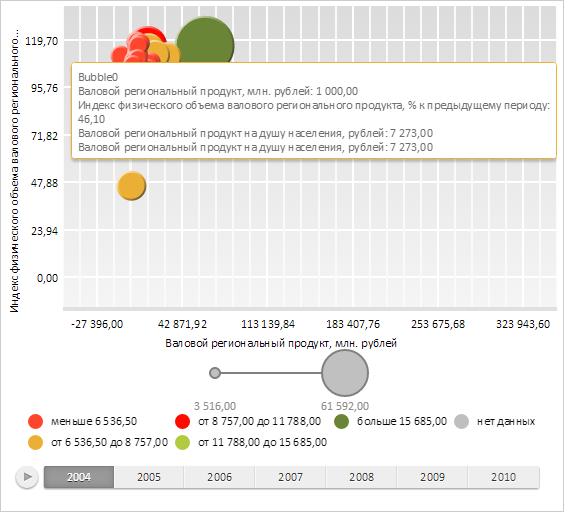

# ChartSerie.Tooltip

ChartSerie.Tooltip
-

**

# ChartSerie.Tooltip

## Синтаксис

Tooltip: [PP.Ui.ChartTooltip](../ChartTooltip/ChartTooltip.htm)

## Описание

Свойство Tooltip** определяет
 всплывающую подсказку для ряда данных.

## Комментарии

Значение свойства устанавливается из JSON и с помощью метода setTooltip,
 а возвращается с помощью метода getTooltip.

## Пример

Для выполнения примера необходимо наличие на html-странице компонента
 [BubbleChart](../../../Components/BubbleChart/BubbleChart.htm)
 с наименованием «bubbleChart» (см. «[Пример
 создания компонента BubbleChart](../../../Components/BubbleChart/BubbleChart_Example.htm)»). Получим всплывающую подсказку ряда
 данных первого элемента пузырьковой диаграммы и отобразим ее:

// Получаем всплывающую подсказку ряда данных первого элемента пузырьковой диаграммы
var tooltip = bubbleChart.getSeries()[0].getTooltip();
// Отображаем всплывающую подсказку
tooltip.show();
В результате на пузырьковой диаграмме была отображена всплывающая подсказка
 ряда данных первого элемента:

См. также:

[ChartSerie](ChartSerie.htm)

		Справочная
		 система на версию 10.9
		 от 18/08/2025,
		 © ООО «ФОРСАЙТ»,
