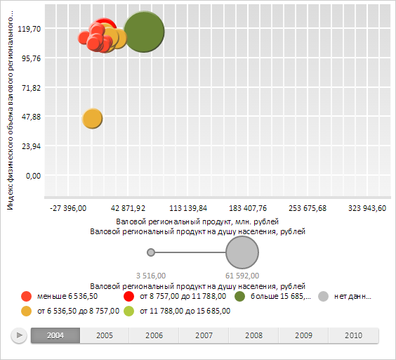
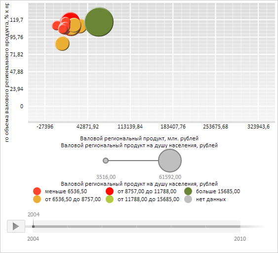

# ChartSerie.animate

ChartSerie.animate
-

**

# ChartSerie.animate

## Синтаксис

animate(value: Number);

## Параметры

*value.* Доля анимации для воспроизведения. Параметр может принимать числовое значение от 0 до 1 включительно.

## Описание

Метод animate** воспроизводит анимацию ряда данных.

## Пример

Для выполнения примера необходимо наличие на html-странице компонента [BubbleChart](../../../Components/BubbleChart/BubbleChart.htm) с наименованием «bubbleChart» (см. «[Пример создания компонента BubbleChart](../../../Components/BubbleChart/BubbleChart_Example.htm)»). Перед выполнением примера пузырьковая диаграмма выглядела следующим образом:

Теперь воспроизведём для первого ряда пузырьковой диаграммы только 80% анимации:

// Получим первый ряд данных пузырьковой диаграммы
var serie = bubbleChart.getSeries()[0]
// Воспроизведём 80% анимации для данного ряда
serie.animate(0.8);

В результате выполнения примера было воспроизведено 80% анимации для первого ряда данных пузырьковой диаграммы:

См. также:

[ChartSerie](ChartSerie.htm)

		Справочная
		 система на версию 10.9
		 от 18/08/2025,
		 © ООО «ФОРСАЙТ»,
