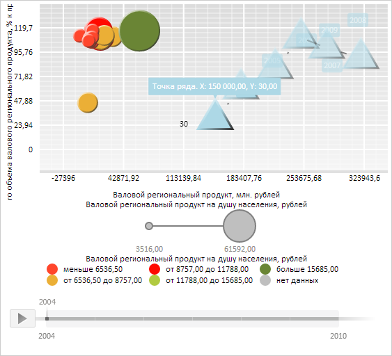

# ChartSerie.setColors

ChartSerie.setColors
-

**

# ChartSerie.setColors

## Синтаксис

setColors(color: String);

## Параметры

*color.* Цвет заливки пузырьков ряда.

## Описание

Метод setColors** устанавливает цвет заливки пузырьков ряда.

## Пример

Для выполнения примера необходимо наличие на html-странице экземпляра класса [ChartSerie](ChartSerie.htm) с наименованием «serie» (см. «[Конструктор ChartSerie](Constructor_ChartSerie.htm)»). Установим для пузырьков ряда голубой цвет заливки:

// Удалим измерение Color
delete serie.getChart().getVisuals().Color;
// Установим голубой цвет заливки пузырьков пузырьковой диаграммы
serie.setColors(PP.Color.Colors.lightblue);
// Заново отрисуем ряд данных
serie.draw();
// Отобразим историю значений данного ряда
serie.getPoints()[0].setIsHistoryOn(true);

В результате выполнения примера для пузырьков пузырьковой диаграммы был установлен голубой цвет заливки:

См. также:

[ChartSerie](ChartSerie.htm)

		Справочная
		 система на версию 10.9
		 от 18/08/2025,
		 © ООО «ФОРСАЙТ»,
