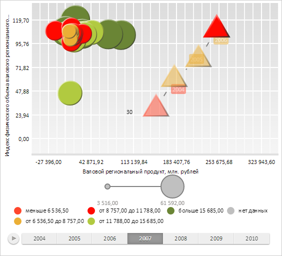

# Конструктор ChartSerie

Конструктор ChartSerie
-

# Конструктор ChartSerie

## Синтаксис

PP.Ui.ChartSerie (settings);

## Параметры

settings. JSON-объект
 со значениями свойств компонента.

## Описание

Конструктор ChartSerie создает
 экземпляр класса [ChartSerie](ChartSerie.htm).

## Пример

Для выполнения примера необходимо наличие на html-странице компонента
 [BubbleChart](../../../Components/BubbleChart/BubbleChart.htm)
 с наименованием «bubbleChart» (см. «[Пример
 создания компонента BubbleChart](../../../Components/BubbleChart/BubbleChart_Example.htm)»). Создадим новый ряд данных и отобразим
 его в пузырьковой диаграмме:

// Получим ряды данных у источника
var series = bubbleChart.getDataSources().ds0.getSeries();
// Определим данные для нового ряда
var newSerie = {
	DimX: new PP.TimeAxis({
		Items: ["150000", "180000", "220000", "250000", "280000", "320000", "NULL"]
	}),
	DimY: new PP.TimeAxis({
		Items: ["30", "60", "80", "110", "100", "90", "80"]
	}),
	DimR: new PP.TimeAxis({
		Items: ["55000", "46000", "36000", "26000", "16000", "260000", "36000"]
	}),
	DimCol: new PP.TimeAxis({
		Items: ["6000", "7000", "8000", "10000", "13000", "15000", "16000"]
	})
};
series["Serie28_Point0"] = newSerie;
// Определим символ для пузырьков пузырьковой диаграммы
var symbol = new PP.Ui.ChartSymbol({
	Chart: bubbleChart,
	// В качестве символа используем треугольник
	MarkerShape: PP.Ui.IntervalsLegendMarkerShape.TriangleUp,
	Thickness: 3 // Толщина границы
});
// Создадим новый ряд
var serie = new PP.Ui.ChartSerie({
	Chart: bubbleChart,
	Index: 0, // Индекс ряда
	Label: new PP.Ui.ChartSVGLabel({ // Подпись ряда
		Text: newSerie.DimY.getItem(0).toString()
	}),
	Points: [new PP.Ui.ChartSeriePoint({ // Определим точки для создаваемого ряда
		Id: "Serie28_Point0",
		Opacity: 1, // Сделаем точки непрозрачными
		Value: "Точка ряда",
		History: new PP.Ui.ChartHistory({
		Chart: bubbleChart, // пузырьковая диаграмма
		}),
		Symbol: symbol,
		Chart: bubbleChart
	})],
	Symbol: symbol,
	//Title: "Новый ряд", // Заголовок ряда
});
// Добавим новый ряд в массив рядов пузырьковой диаграммы
bubbleChart.getSeries().push(serie);
// Отобразим всплывающую подсказку
var point = serie.getPoints()[0];
// Устанавливаем шаг временной шкалы
bubbleChart.setTimelineStep(3);
// Нарисуем созданный ряд
serie.draw();
point.draw();
point.setIsHistoryOn(true);
point.renderFrame(bubbleChart.getChartArea().getPaper());
// Устанавливаем выравнивание меток истории по правому краю
serie.getHistory().setIsRTL(false);
// Отобразим метку для первой точки ряда
serie.getLabel().setPosition(190, 210);
serie.getLabel().draw(null, bubbleChart.getChartArea().getPaper());
bubbleChart.refreshAll();
В результате выполнения примера был создан и отображён в пузырьковой
 диаграмме новый ряд. Для его построения предварительно были определены
 новые наборы данных.

Для пузырьков ряда был задан треугольный символ с толщиной границы,
 равной 3 пикселям:

См. также:

[ChartSerie](ChartSerie.htm)

		Справочная
		 система на версию 10.9
		 от 18/08/2025,
		 © ООО «ФОРСАЙТ»,
