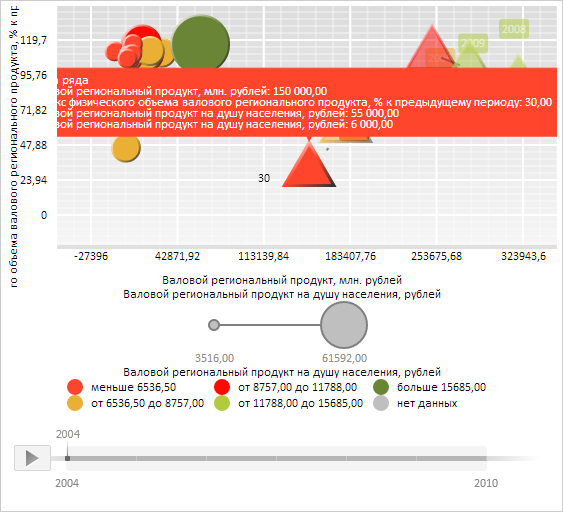

# ChartSeriePoint.getTooltipMask

ChartSeriePoint.getTooltipMask
-

**

# ChartSeriePoint.getTooltipMask

## Синтаксис

getTooltipMask();

## Описание

Метод getTooltipMask** создаёт и возвращает шаблон текста всплывающей подсказки.

## Комментарии

Метод возвращает значение типа String.

## Пример

Для выполнения примера необходимо наличие на html-странице экземпляра класса [ChartSeriePoint](ChartSeriePoint.htm) с наименованием «point» (см. «[Конструктор ChartSerie](../ChartSerie/Constructor_ChartSerie.htm)»). Определим и зададим для пузырька созданного ряда новый шаблон текста всплывающей подсказки:

// Определим и зададим для пузырька новый шаблон текста всплывающей подсказки
var tooltipMask = point.getTooltipMask();
console.log("Шаблон текста всплывающей подсказки:");
console.log(tooltipMask);
// Определим значения, выводимые в тексте всплывающей подсказки
var tooltipValues = point.getTooltipValues();
console.log("");
console.log("Текст всплывающей подсказки:")
console.log(tooltipValues.Name);
console.log(tooltipValues.XTitle + ": " + tooltipValues.XValue);
console.log(tooltipValues.YTitle + ": " + tooltipValues.YValue);
console.log(tooltipValues.SizeTitle + ": " + tooltipValues.SizeValue);
console.log(tooltipValues.ColorTitle + ": " + tooltipValues.ColorValue);
// Обновим пузырьковую диаграмму
bubbleChart.refresh();

В результате выполнения примера для пузырька созданного ряда был установлен новый шаблон текста всплывающей подсказки:

Данный шаблон и сам текст всплывающей подсказки были также выведены в консоли браузера:

Шаблон текста всплывающей подсказки:

{%Name}

{%XTitle}: {%XValue:#,##.00}

{%YTitle}: {%YValue:#,##.00}

{%SizeTitle}: {%SizeValue:#,##.00}

{%ColorTitle}: {%ColorValue:#,##.00}

Текст всплывающей подсказки:

Точка ряда

Валовой региональный продукт, млн. рублей: 150000

Индекс физического объема валового регионального продукта, % к предыдущему периоду: 30

Валовой региональный продукт на душу населения, рублей: 55000

Валовой региональный продукт на душу населения, рублей: 6000

См. также:

[ChartSeriePoint](ChartSeriePoint.htm)

		Справочная
		 система на версию 10.9
		 от 18/08/2025,
		 © ООО «ФОРСАЙТ»,
