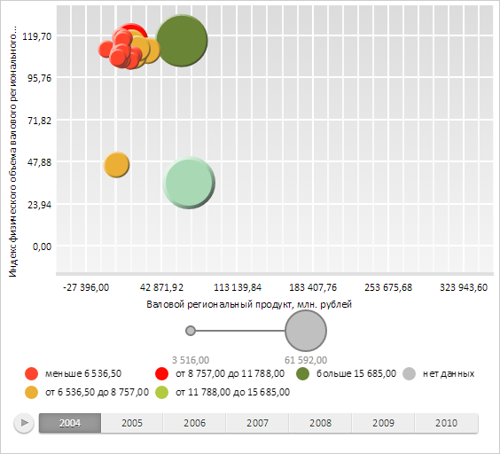

# Конструктор ChartSymbol

Конструктор ChartSymbol
-

# Конструктор ChartSymbol

## Синтаксис

PP.Ui.ChartSymbol(settings);

## Параметры

settings. JSON-объект
 со значениями свойств класса.

## Описание

Конструктор ChartSymbol создает
 экземпляр класса ChartSymbol.

## Пример

Для выполнения примера необходимо наличие на html-странице компонента
 [BubbleChart](../../../Components/BubbleChart/BubbleChart.htm)
 с наименованием «bubbleChart» (см. «[Пример
 создания компонента BubbleChart](../../../Components/BubbleChart/BubbleChart_Example.htm)»). Создадим новый символ и отрисуем
 его, получим и выведем данные о радиусе и местоположении символа:

// Создадим новый символ пузырьковой диаграммы
var symbol = new PP.Ui.ChartSymbol({
    X: 150,
    Y: 200,
    R: 30,
    Color: "#A9D8B5",
    Opacity: 1,
    Thickness: 4,
    MarkerShape: PP.Ui.IntervalsLegendMarkerShape.Circle,
    Chart: bubbleChart
});
// Отрисуем символ пузырьковой диаграммы
symbol.draw();
symbol.renderFrame(bubbleChart.getChartArea().getPaper());
// Получим данные о размере и местоположении символа
var path = symbol.getPath().getPrimitives()[0];
console.log("Координаты центра символа: (" + path.cx + "," + path.cy + "); Радиус символа: " + symbol.getR());
В результате выполнения примера был создан и отрисован новый символ:

Также в консоли браузера были выведены данные о радиусе и местоположении
 символа:

Координаты центра символа: (200,150); Радиус символа:
 30

См. также:

[ChartSymbol](ChartSymbol.htm)

		Справочная
		 система на версию 10.9
		 от 18/08/2025,
		 © ООО «ФОРСАЙТ»,
