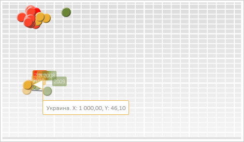
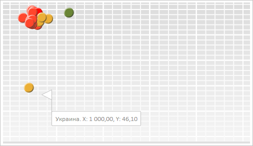

# ChartTooltipBase.HoverMode

ChartTooltipBase.HoverMode
-

**

# ChartTooltipBase.HoverMode

## Синтаксис

HoverMode: [PP.HoverMode](../../../Enums/PP.HoverMode.htm);

## Описание

Свойство HoverMode определяет
 метод отображения всплывающей подсказки.

## Комментарии

Значение свойства устанавливается из JSON и с помощью метода setHoverMode,
 а возвращается с помощью метода getHoverMode.**

## Пример

Для выполнения примера необходимо наличие на html-странице компонента
 [BubbleChart](../../../Components/BubbleChart/BubbleChart.htm)
 с наименованием «bubbleChart» (см. «[Пример
 создания компонента BubbleChart](../../../Components/BubbleChart/BubbleChart_Example.htm)»). Определим новый объект всплывающей
 подсказки и установим ещё для ряда данных с индексом 0:

// Определим всплывающую подсказку
var tooltip = new PP.Ui.ChartTooltip({
    HasMask: true, // Текст подсказки формируем по шаблону
    MaskText: "{%Name}. X: {%XValue:#,##.00}, Y: {%YValue:#,##.00}", // Шаблон подсказки
    HoverMode: PP.HoverMode.MouseOver, // Активация подсказки по наведению курсора мыши
});
// Установим подсказку для ряда данных с индексом 0
var serie = bubbleChart.getSeries()[0];
serie.setTooltip(tooltip);
Наведем курсор мыши на пузырёк, показанный на следующем скриншоте. В
 результате будет отображена всплывающая подсказка с установленными параметрами:

Отобразим подсказку и установим для неё новое положение:

// Отобразим подсказку
tooltip.show();
// Установим новое положение подсказки
tooltip.setPosition(tooltip.getTargetX() + 10, tooltip.getTargetY() + 10);
В результате позиция всплывающей подсказки была изменена:

См. также:

[ChartTooltipBase](ChartTooltipBase.htm)

		Справочная
		 система на версию 10.9
		 от 18/08/2025,
		 © ООО «ФОРСАЙТ»,
