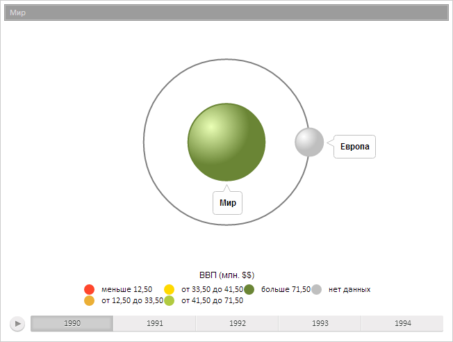

# BubbleTree.Alignment

BubbleTree.Alignment
-

**

# BubbleTree.Alignment

## Синтаксис

Alignment: [PP.Ui.BubbleTreeAlignment](../../Enums/BubbleTreeAlignment.htm)

## Описание

Свойство Alignment** определяет ориентацию пузырькового дерева.

## Комментарии

Значение свойства устанавливается из JSON и с помощью метода set**Alignment**, а возвращается с помощью метода get**Alignment****.**

## Пример

Для выполнения примера предполагается наличие на странице компонента [BubbleTree](../../Components/BubbleTree/BubbleTree.htm) с наименованием «bubbleTree» (см. «[Пример создания компонента BubbleTree](../../Components/BubbleTree/BubbleTree_Example.htm)» ). Установим минимальный размер пузырька диаграммы и ориентацию диаграммы, после чего обновим её. Получим координаты центра диаграммы, значение цвета, устанавливаемое при отсутствии данных, размеры свободной области диаграммы, положение легенды, тип масштаба размеров, название свойства настроек компонента. Определим, находится ли точка с указанными координатами за пределами компонента:

// Установим минимальный размер пузырька диаграммы
bubbleTree.setBubbleMinSize(20);
// Установим ориентацию диаграммы
bubbleTree.setAlignment(PP.Ui.BubbleTreeAlignment.Right);
// Обновим диаграмму
bubbleTree.refresh();
// Получим значения ориентации диаграммы
var align = bubbleTree.getAlign();
console.log("Значения ориентации диаграммы: X:" + align.X + " Y:" + align.Y);
// Получим координаты центра диаграммы
var center = bubbleTree.getCenter();
console.log("Координаты центра диаграммы: X:" + center.X + " Y:" + center.Y);
// Получим настройки для панели цвета в формате настроек мастера
var colorOptions = bubbleTree.getColorOptions();
// Выведем значение цвета, устанавливаемое при отсутствии данных
var ndc = colorOptions[8].Value;
console.log("Цвет, устанавливаемый при отсутствии данных: R:" + ndc.getR() + " G:" + ndc.getG() + " B:" + ndc.getB());
// Получим свободную область диаграммы, в которой располагаются элементы
var freeArea = bubbleTree.getFreeArea();
console.log("Размеры свободной области диаграммы: " + freeArea.getWidth() + "x" + freeArea.getHeight())
// Получим настройки для панели легенды в формате настроек мастера
var legendOptions = bubbleTree.getLegendOptions();
// Выведем положение легенды
console.log("Положение легенды: " + legendOptions[0].Value);
// Получим настройки для панели размеров в формате настроек мастера
var sizeOptions = bubbleTree.getSizeOptions();
// Выведем тип масштаба размеров
console.log("Тип масштаба размеров: " + sizeOptions[0].Value)
// Получим настройки компонента в формате настроек мастера
var state = bubbleTree.getState();
// Выведем название свойства настроек компонента
console.log("Название свойства настроек компонента: " + state.getPropertyName());
// Определим, находится ли точка с указанными координатами за пределами компонента
var point = {
    X: 50,
    Y: 100
};
var res1 = "Точка (" + point.X + "," + point.Y + ") находится в пределах границ компонента"
var res2 = "Точка (" + point.X + "," + point.Y + ") находится за пределами границ компонента"
console.log(bubbleTree.isPointOut(point.X, point.Y) ? res2 : res1)

В результате выполнения примера была установлена новая ориентация диаграммы, был изменен минимальный размер пузырьков диаграммы:

Также в консоли браузера были выведены координаты центра диаграммы, значение цвета, устанавливаемое при отсутствии данных, размеры свободной области диаграммы, положение легенды, тип масштаба размеров, название свойства настроек компонента, результат определения местоположения точки:

Значения ориентации диаграммы: X:1 Y:0

Координаты центра диаграммы: X:320 Y:174.5

Цвет, устанавливаемый при отсутствии данных: R:191 G:191 B:191

Размеры свободной области диаграммы: 640x349

Положение легенды: Bottom&Center

Тип масштаба размеров: Linear

Название свойства настроек компонента: TreeChartSettings

Точка (50,100) находится в пределах границ компонента

См. также:

[BubbleTree](BubbleTree.htm)

		Справочная
		 система на версию 10.9
		 от 18/08/2025,
		 © ООО «ФОРСАЙТ»,
