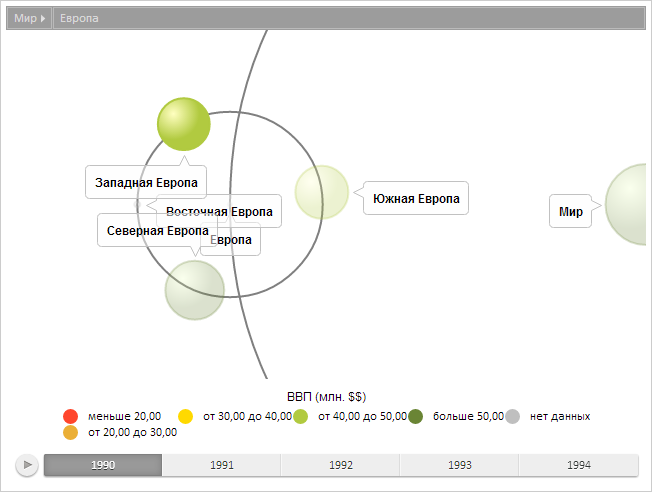

# BubbleTree.hoverItems

BubbleTree.hoverItems
-

# BubbleTree.hoverItems

## Синтаксис

hoverItems(items: Object, timelineStep: Number);

## Параметры

items. Элементы пузырькового
 дерева, на которые необходимо навести указатель;

timelineStep. Шаг временной
 шкалы.

## Описание

Метод hoverItems устанавливает
 наведение указателя на элементы пузырькового дерева.

## Пример

Для выполнения примера предполагается наличие на странице компонента
 [BubbleTree](../../Components/BubbleTree/BubbleTree.htm) с
 наименованием «bubbleTree» (см. «[Пример
 создания компонента BubbleTree](../../Components/BubbleTree/BubbleTree_Example.htm)» ).

Получим модель данных, установим новый активный элемент, установим обработчик
 события [ItemsHovered](BubbleTree.ItemsHovered.htm) и вызовем
 это событие:

// Получаем модель данных
var model = bubbleTree.getModel()
// Получаем элемент по идентификатору
var item = model.getItem("EU");
// Устанавливаем новый активный элемент
model.setActiveItem(item);
// Получаем корневой элемент диаграммы
var rootItem = model.getRootItem();
// Устанавливаем новый корневой элемент
model.setRootItem(rootItem);
// Получаем элемент пузырькового дерева с идентификатором «WEU»
var bubbleTreeItem = bubbleTree.getModel().getItem("WEU");
// Определяем объект для выделения элемента с помощью наведения мыши
items = {};
items[bubbleTreeItem.getId()] = true;
// Добавляем обработчик события ItemsHovered
bubbleTree.ItemsHovered.add(
    function () {
        console.log("Событие ItemsHovered");
        // Устанавливаем наведение указателя на элемент пузырькового дерева
        bubbleTree.hoverItems(items, 0);
    }
);
// Вызываем событие ItemsHovered
bubbleTree.fireItemsHovered();
// Обновляем диаграмму
bubbleTree.refresh();
В результате был установлен новый активный элемент, а также установлено
 наведение указателя на элемент пузырькового дерева с идентификатором «WEU»:

Также в консоли браузера было выведено сообщение о вызове обработанного
 события:

Событие ItemsHovered

[BubbleTree](BubbleTree.htm)

		Справочная
		 система на версию 10.9
		 от 18/08/2025,
		 © ООО «ФОРСАЙТ»,
