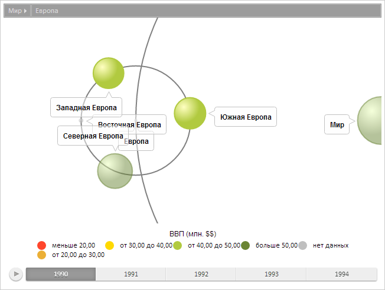

# BubbleTree.selectItem

BubbleTree.selectItem
-

# BubbleTree.selectItem

## Синтаксис

selectItem(item: Object, reset: Boolean);

## Параметры

item. Элемент пузырькового
 дерева для выделения. Если указано значение null,
 то выделение всех элементов сбрасывается;

reset. Признак того, будет
 ли сброшено выделение всех элементов перед выполнением метода.

## Описание

Метод selectItem выделяет указанный
 элемент пузырькового дерева.

## Пример

Для выполнения примера предполагается наличие на странице компонента
 [BubbleTree](../../Components/BubbleTree/BubbleTree.htm) с
 наименованием «bubbleTree» (см. «[Пример
 создания компонента BubbleTree](../../Components/BubbleTree/BubbleTree_Example.htm)»).

Получим модель данных, установим новый активный элемент,выделим указанные
 элементы пузырькового дерева и обновим диаграмму:

// Получаем модель данных
var model = bubbleTree.getModel()
// Получаем элемент по идентификатору
var item = model.getItem("EU");
// Устанавливаем новый активный элемент
model.setActiveItem(item);
// Получаем вершину дерева элементов пузырьковой диаграммы
var rootItem = model.getRootItem();
// Устанавливаем новый корневой элемент
model.setRootItem(rootItem);
// Получаем элемент пузырькового дерева с идентификатором «SEU»
var bubbleTreeItem = bubbleTree.getModel().getItem("SEU");
// Выделяем полученный элемент
bubbleTree.selectItem(bubbleTreeItem, false);
// Получаем элемент пузырькового дерева с идентификатором «WEU»
var bubbleTreeItem1 = bubbleTree.getModel().getItem("WEU");
// Определяем объект для выделения другого элемента
items = {};
items[bubbleTreeItem1.getId()] = true;
// Выделяем дополнительно второй элемент
bubbleTree.selectItems(items, false);
// Обновляем диаграмму
bubbleTree.refresh();
В результате был установлен новый активный элемент, к которому было
 переведено представление пузырькового дерева, а также установлено выделение
 элементов с идентификаторами «SEU» и «WEU»:

[BubbleTree](BubbleTree.htm)

		Справочная
		 система на версию 10.9
		 от 18/08/2025,
		 © ООО «ФОРСАЙТ»,
