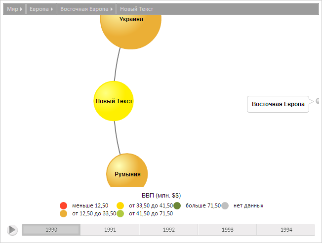

# BubbleTreeItem.Color

BubbleTreeItem.Color
-

**

# BubbleTreeItem.Color

## Синтаксис

Color: [PP.SolidColorBrush](dhtmlCommon.chm::/Classes/PP/SolidColorBrush/SolidColorBrush.htm)
 || String

## Описание

Свойство Color** определяет
 цвет элемента пузырькового дерева.

## Комментарии

Значение свойства устанавливается из JSON и с помощью метода set**Color**,
 а возвращается с помощью метода get**Color**.

## Пример

Для выполнения примера предполагается наличие на странице компонента
 [BubbleTree](../../Components/BubbleTree/BubbleTree.htm) с
 наименованием «bubbleTree» (см. «[Пример
 создания компонента BubbleTree](../../Components/BubbleTree/BubbleTree_Example.htm)» ). Установим новое текстовое содержимое
 элемента и обновим его, установим направление вращения, переведем сцену
 к полученному элементу. Установим новое значение цвета и обновим цвета
 элемента, получим контейнер элемента и установим минимальный размер соседних
 пузырьков, установим новое значение размера элемента:

// Получим модель данных
var model = bubbleTree.getModel()
// Получим элемент по идентификатору
var item = model.getItem("RUS");
// Установим новое текстовое содержимое
item.setCaption("Новый Текст");
// Обновим текстовое содержимое
item.updateContent()
// Установим направление вращения по часовой стрелке
item.setRotationDirection(true);
// Переведем сцену к полученному элементу
bubbleTree.drillTo(item);
// Получим кисть закраски элемента
var brush = item.getColor();
// Установим новое значение цвета
brush.setColor("#FFF000");
// Установим новую кисть
item.setColor(brush);
// Получим контейнер элемента
var c = item.getContainer();
// Установим минимальный размер соседних пузырьков
c.setSideBubbleMinSize(40);
// Установим новый контейнер
item.setContainer(c);
// Установим новый размер элемента
item.setSize(10);

В результате выполнения примера было установлено новое текстовое содержимое
 элемента, сцена была приведена к этому элементу, было установлено новое
 значение цвета. Также был изменен размер соседних пузырьков и размер самого
 элемента:

См. также:

[BubbleTreeItem](BubbleTreeItem.htm)

		Справочная
		 система на версию 10.9
		 от 18/08/2025,
		 © ООО «ФОРСАЙТ»,
