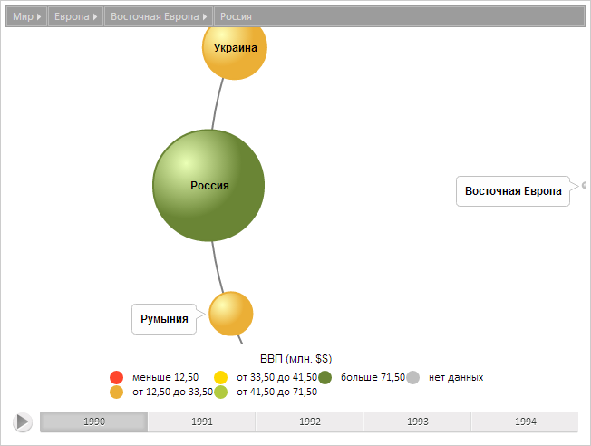

# BubbleTreeItem.getNeighbors

BubbleTreeItem.getNeighbors
-

**

# BubbleTreeItem.getNeighbors

## Синтаксис

getNeighbors();

## Описание

Метод getNeighbors** возвращает соседние элементы текущего элемента плоского дерева.

## Комментарии

Метод возвращает массив объектов типа [PP.Ui.BubbleTreeItem](BubbleTreeItem.htm).

## Пример

Для выполнения примера предполагается наличие на странице компонента [BubbleTree](../../Components/BubbleTree/BubbleTree.htm) с наименованием «bubbleTree» (см. «[Пример создания компонента BubbleTree](../../Components/BubbleTree/BubbleTree_Example.htm)» ). Получим элемент и переведем к нему диаграмму, получим список соседних элементов и выведем их имена, выведем размер текущего элемента:

// Получим модель данных
var model = bubbleTree.getModel()
// Получим элемент по идентификатору
var item = model.getItem("RUS");
// Переведем сцену к полученному элементу
bubbleTree.drillTo(item);
// Получим соседние элементы
var neighbors = item.getNeighbors();
// Объявим перемнную для списка имен соседних элементов
var names = "";
// Сформируем список имен соседних элементов
for (var i = 0; i < neighbors.length; i++) {
    names += neighbors[i].getCaption() + " ";
}
// Выведем имена соседних элементов
console.log("Имена соседних элементов : " + names);
// Выведем радиус элемента
console.log("Радиус элемента: " + item.getRadius());

В результате выполнения примера сцена была приведена к полученному элементу:

Также в консоли браузера были выведены имена соседних элементов полученного элемента и его радиус:

Имена соседних элементов : Украина Румыния

Радиус элемента: 8.451542547285166

См. также:

[BubbleTreeItem](BubbleTreeItem.htm)

		Справочная
		 система на версию 10.9
		 от 18/08/2025,
		 © ООО «ФОРСАЙТ»,
