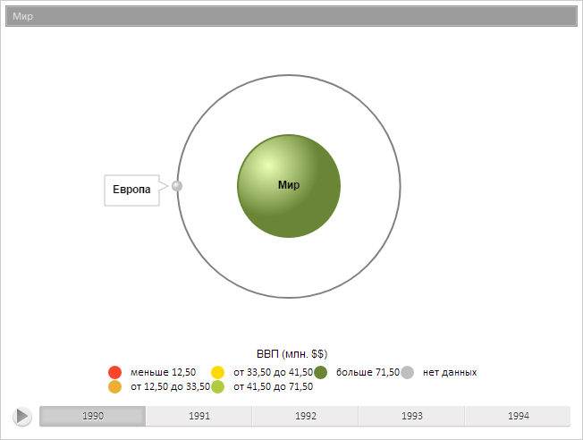

# BubbleTreeItem.Text

BubbleTreeItem.Text
-

**

# BubbleTreeItem.Text

## Синтаксис

text: Number

## Описание

Свойство Text** определяет
 значение настройки текста элемента пузырькового дерева.

## Комментарии

Значение свойства устанавливается из JSON и с помощью метода setText,
 а возвращается с помощью метода getText.

## Пример

Для выполнения примера предполагается наличие на странице компонента
 [BubbleTree](../../Components/BubbleTree/BubbleTree.htm) с
 наименованием «bubbleTree» (см. «[Пример
 создания компонента BubbleTree](../../Components/BubbleTree/BubbleTree_Example.htm)» ).

// Получим модель данных
var model = bubbleTree.getModel();
// Получим элемент по идентификатору
var item = model.getItem("EU");
// Отобразим имя элемента
console.log("Имя элемента: " + item.getValues().Name);
// Отобразим значение настройки текста элемента с идентификатором "RUS"
console.log("Значение настройки текста элемента: " + model.getItem("RUS").getText());

В результате выполнения примера появится заданный элемент на пузырьковом
 дереве :

В консоли браузера будет выведено имя отображаемого элемента и значение
 настройки текста элемента с заданным идентификатором:

Имя элемента: Европа

Значение настройки текста элемента: 140

См. также:

[BubbleTreeItem](BubbleTreeItem.htm)

		Справочная
		 система на версию 10.9
		 от 18/08/2025,
		 © ООО «ФОРСАЙТ»,
