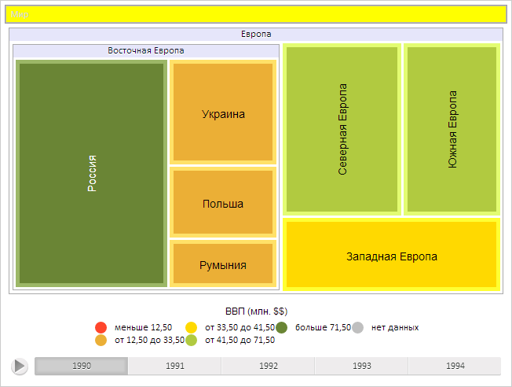

# ChartBreadcrumb.ItemStyle

ChartBreadcrumb.ItemStyle
-

**

# ChartBreadcrumb.ItemStyle

## Синтаксис

ItemStyle: Object

## Описание

Свойство ItemStyle** определяет
 стиль элементов цепочки навигации.

## Комментарии

Значение свойства устанавливается из JSON и с помощью метода set**ItemStyle**,
 а возвращается с помощью метода get**ItemStyle****.**

## Пример

Для выполнения примера предполагается наличие на странице компонента
 [TreeMap](../../Components/TreeMap/TreeMap.htm) с наименованием
 «treeMap» (см. «[Пример
 создания компонента TreeMap](../../Components/TreeMap/TreeMap_example.htm)» ). Установим новый фоновый цвет элементов
 цепочки навигации и обновим её, обработаем события [ItemClicked](ChartBreadcrumb.ItemClicked.htm)
 и [ItemClicking](ChartBreadcrumb.ItemClicking.htm):

// Получим цепочку навигации по уровням элементов
var breadcrumb = treeMap.getBreadcrumb();
// Получим стиль элементов цепочки навигации
var itemStyle = breadcrumb.getItemStyle();
// Установим новый фоновый цвет элементов цепочки навигации
itemStyle.Style.Release.Background.Color = "#FFFF00";
// Применим новый стиль
breadcrumb.setItemStyle(itemStyle);
// Обновим цепочку навигации
breadcrumb.update();
// Обработаем событие ItemClicked
breadcrumb.ItemClicked.add(function (sender, args, timeout) {
    console.log("Инициировано событие ItemClicked")
    breadcrumb.ItemClicking.fire(this)
});
// Обработаем событие ItemClicking
breadcrumb.ItemClicking.add(function (sender, args, timeout) {
    console.log("Инициировано событие ItemClicking")
});

В результате был изменен фоновый цвет элементов цепочки навигации:

Щёлкнем по элементу цепочки навигации.

В результате в консоли браузера были выведены сообщения о вызове обработанных
 событий:

Инициировано событие ItemClicked

Инициировано событие ItemClicking

См. также:

[ChartBreadcrumb](ChartBreadcrumb.htm)

		Справочная
		 система на версию 10.9
		 от 18/08/2025,
		 © ООО «ФОРСАЙТ»,
