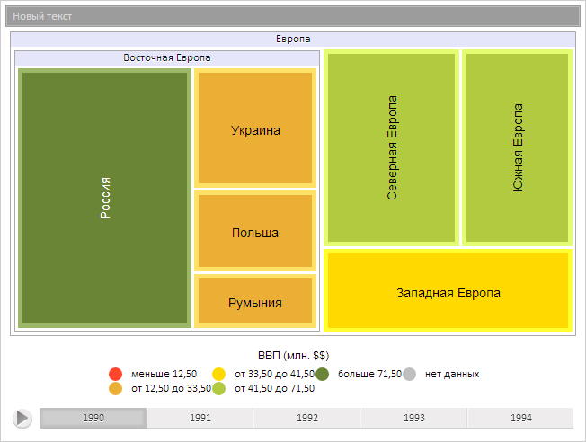

# ChartBreadcrumb.Model

ChartBreadcrumb.Model
-

**

# ChartBreadcrumb.Model

## Синтаксис

Model: [PP.TreeModel](dhtmlUiTree.chm::/Classes/TreeModel/TreeModel.htm)

## Описание

Свойство Model** определяет
 модель данных цепочки навигации.

## Комментарии

Значение свойства устанавливается из JSON и с помощью метода set**Model**,
 а возвращается с помощью метода get**Model****.**

## Пример

Для выполнения примера предполагается наличие на странице компонента
 [TreeMap](../../Components/TreeMap/TreeMap.htm) с наименованием
 «treeMap» (см. «[Пример
 создания компонента TreeMap](../../Components/TreeMap/TreeMap_example.htm)» ). Получим модель данных, установим новое
 текстовое содержимое активного элемента цепочки навигации, установим новое
 значение модели данных:

// Получим цепочку навигации по уровням элементов
var breadcrumb = treeMap.getBreadcrumb();
// Получим модель данных
var model = breadcrumb.getModel();
// Получим активный элемент
var ai = model.getActiveItem();
// Установим новое текстовое содержимое активного элемента
ai.setCaption("Новый текст");
// Установим новый активный элемент
model.setActiveItem(ai);
// Установим новую модель данных
breadcrumb.setModel(model);
// Обновим цепочку навигации
breadcrumb.update();

В результате выполнения примера было изменено текстовое содержимое активного
 элемента цепочки навигации:

См. также:

[ChartBreadcrumb](ChartBreadcrumb.htm)

		Справочная
		 система на версию 10.9
		 от 18/08/2025,
		 © ООО «ФОРСАЙТ»,
