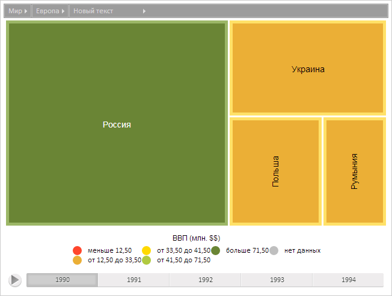

# ChartBreadcrumbItem.Caption

ChartBreadcrumbItem.Caption
-

**

# ChartBreadcrumbItem.Caption

## Синтаксис

Caption: String

## Описание

Свойство Caption** определяет текстовое содержимое элемента цепочки навигации.

## Комментарии

Значение свойства устанавливается из JSON и с помощью метода set**Caption**, а возвращается с помощью метода get**Caption**

## Пример

Для выполнения примера предполагается наличие на странице компонента [TreeMap](../../Components/TreeMap/TreeMap.htm) с наименованием «treeMap» (см. «[Пример создания компонента TreeMap](../../Components/TreeMap/TreeMap_example.htm)» ). Приведем диаграмму к элементу с индексом 2, установим новое текстовое содержимое элемента цепочки навигации с индексом 0, обновим текстовую метку элемента цепочки навигации, установим элемент как не последний элемент цепочки.

// Приведем диаграмму к элементу с индексом 2
treeMap.getSceneItems()[2].drill();
// Получим меню навигации по уровням элементов
var breadcrumb = treeMap.getBreadcrumb();
// Получим элемент с индексом 0
var item = breadcrumb._items[0];
// Установим новое текстовое содержимое
item.setCaption("Новый текст");
// Обновим текстовую метку элемента цепочки навигации
item.updateLabel();
// Установим элемент как не последний элемент цепочки
item.setLastItem(false);

В результате выполнения примера было установлено новое текстовое содержимое элемента цепочки навигации, элемент был установлен как не последний элемент цепочки:

См. также:

[ChartBreadcrumbItem](ChartBreadcrumbItem.htm)

		Справочная
		 система на версию 10.9
		 от 18/08/2025,
		 © ООО «ФОРСАЙТ»,
