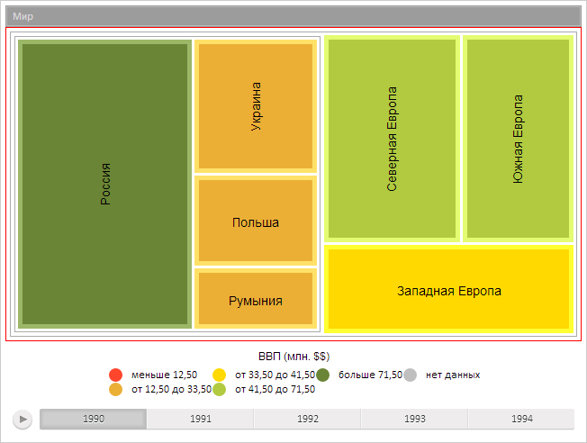

# TreeMap.AreHeadersVisible

TreeMap.AreHeadersVisible
-

**

# TreeMap.AreHeadersVisible

## Синтаксис

AreHeadersVisible: Boolean

## Описание

Свойство AreHeadersVisible**
 определяет признак отображения заголовков групп элементов.

## Комментарии

Значение свойства устанавливается из JSON и с помощью метода set**AreHeadersVisible**,
 а возвращается с помощью метода get**AreHeadersVisible****.**

Если свойство имеет значение true,
 заголовки будут отображаться, иначе - не будут.

По умолчанию свойство имеет значение true.

## Пример

Для выполнения примера предполагается наличие на странице компонента
 [TreeMap](../../Components/TreeMap/TreeMap.htm) с наименованием
 «treeMap» (см. «[Пример
 создания компонента TreeMap](../../Components/TreeMap/TreeMap_example.htm)» ). Скроем заголовки групп элементов,
 отключим автоматический расчет цвета текста элементов:

// Скроем заголовки групп элементов
treeMap.setAreHeadersVisible(false);
// Отключим автоматический расчет цвета текста элементов
treeMap.setLabelAutoColor(false);
// Обновим компонент
treeMap.refresh();

В результате выполнения примера были скрыты заголовки групп элементов,
 отключен автоматический расчет цвета текста элементов:

См. также:

[TreeMap](TreeMap.htm)

		Справочная
		 система на версию 10.9
		 от 18/08/2025,
		 © ООО «ФОРСАЙТ»,
