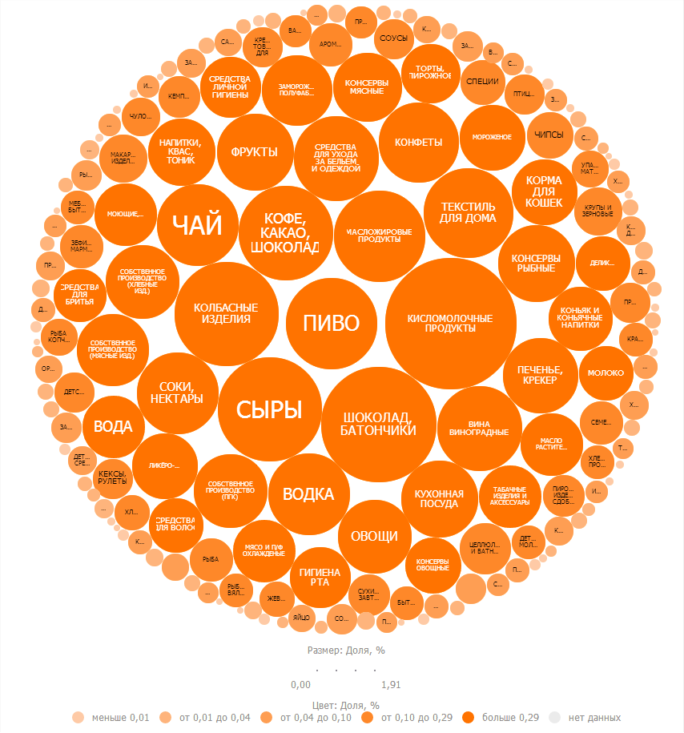

# TreeMap.Circular

TreeMap.Circular
-

# TreeMap.Circular

## Синтаксис

Circular: Boolean;

## Описание

Свойство Circular определяет
 используется ли круговое отображение элементов.

## Комментарии

Значение свойства устанавливается из JSON и с помощью метода setCircular(Boolean),
 а возвращается с помощью метода getCircular().

При значении true плоское дерево
 принимает следующий вид:

## Пример

Для выполнения примера предполагается наличие на странице компонента
 [TreeMap](../../Components/TreeMap/TreeMap.htm) с наименованием
 «treeMap» (см. «[Пример
 создания компонента TreeMap](../../Components/TreeMap/TreeMap_example.htm)» ):

// Зададим круговое отображение
treeMap.setCircular(true);
В результате выполнения примера дерево было представлено в круговом
 отображении.

См. также:

[TreeMap](TreeMap.htm)

		Справочная
		 система на версию 10.9
		 от 18/08/2025,
		 © ООО «ФОРСАЙТ»,
