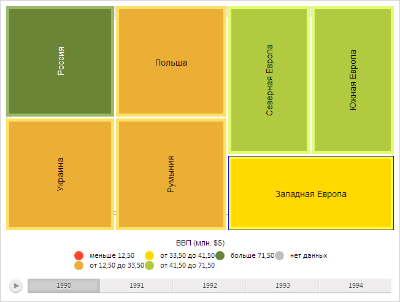

# TreeMap.HeatMap

TreeMap.HeatMap
-

**

# TreeMap.HeatMap

## Синтаксис

HeatMap: Boolean

## Описание

Свойство HeatMap** определяет,
 будет ли плоское дерево отображено в режиме теплокарты.

## Комментарии

Значение свойства устанавливается из JSON и с помощью метода set**HeatMap**,
 а возвращается с помощью метода get**HeatMap****.**

Если свойство имеет значение true,
 плоское дерево будет отображена в режиме теплокарты, иначе - в обычном
 режиме.

По умолчанию свойство имеет значение false.

## Пример

Для выполнения примера предполагается наличие на странице компонента
 [TreeMap](../../Components/TreeMap/TreeMap.htm) с наименованием
 «treeMap» (см. «[Пример
 создания компонента TreeMap](../../Components/TreeMap/TreeMap_example.htm)» ). Отобразим плоское дерево в режиме
 теплокарты, установим фокусную рамку для элементов:

// Скроем заголовки групп элементов
treeMap.setAreHeadersVisible(false);
// Обновим компонент
treeMap.refresh();
// Отобразим диаграмму в режиме теплокарты
treeMap.setHeatMap(true);

В результате выполнения примера плоское дерево было отображено в режиме
 теплокарты:

См. также:

[TreeMap](TreeMap.htm)

		Справочная
		 система на версию 10.9
		 от 18/08/2025,
		 © ООО «ФОРСАЙТ»,
