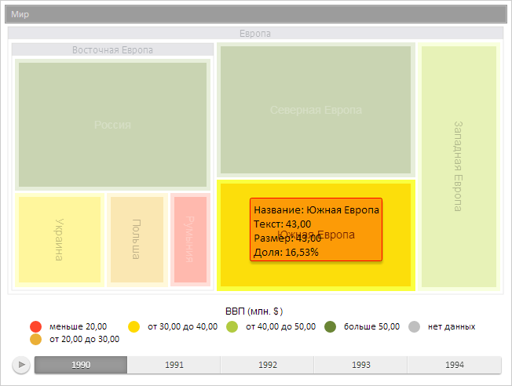

# TreeMap.hoverItems

TreeMap.hoverItems
-

# TreeMap.hoverItems

## Синтаксис

hoverItems(items: Object, timelineStep: Number);

## Параметры

items. JSON-объект, поля
 которого соответствуют идентификаторам выделяемых элементов плоского дерева;

timelineStep. Индекс шага временной
 оси.

## Описание

Метод hoverItems устанавливает
 наведение на элемент плоского дерева.

## Пример

Для выполнения примера предполагается наличие на странице компонента
 [TreeMap](../../Components/TreeMap/TreeMap.htm) с наименованием
 «treeMap» (см. «[Пример
 создания компонента TreeMap](../../Components/TreeMap/TreeMap_example.htm)»). Для элемента плоского дерева «Южная
 Европа» выполним заливку жёлтого цвета, установим и обработаем наведение,
 отображая для него всплывающую подсказку с границей, цвет которой отличается
 от цвета элемента:

// Обработаем событие ItemsHovered
treeMap.ItemsHovered.add(function (sender, args) {
    if (args.Items != null) {
        for (var i in args.Items) {
            // Получаем элемент плоского дерева
            var treeMapItem = treeMap.getModel().getItem(i);
            // Отображаем для него всплывающую подсказу
            treeMapItem.showTooltip();
        };
    }
});
// Цвет границы всплывающей подсказки должен отличать от цвета элемента
var treeMapExt = new PP.Ui.TreeMap({
    UseItemColorForToolTipBorder: false
});
PP.overrideObject(treeMap, treeMapExt, "_UseItemColorForToolTipBorder");
// Получаем элемент плоского дерева «Южная Европа»
var treeMapItem = treeMap.getModel().getItem("SEU");
// Имитируем наведение курсора на данный элемент
items = {};
items[treeMapItem.getId()] = true;
treeMap.hoverItems(items, 0);
// Генерируем событие наведения на элемент
treeMap.fireItemsHovered(treeMapItem.getId());
// Определяем цвет данного элемента
var targetColor = new PP.SolidColorBrush({
    Color: "#ffd900"
});
// Запрещаем автоматическое раскрашивание элемента
treeMap.setLabelAutoColor(false);
// Устанавливаем цвет заливки элемента
treeMapItem.setTargetColor(targetColor, 0.8);
// Воспроизводим анимацию
treeMapItem.animationStep(1);
// Обновляем элемент плоского дерева
treeMapItem.update();
В результате выполнения примера для элемента плоского дерева «Южная
 Европа» была выполнена заливка жёлтого цвета и отображена всплывающая
 подсказка с границей, цвет которой отличается от цвета элемента:

[TreeMap](TreeMap.htm)

		Справочная
		 система на версию 10.9
		 от 18/08/2025,
		 © ООО «ФОРСАЙТ»,
