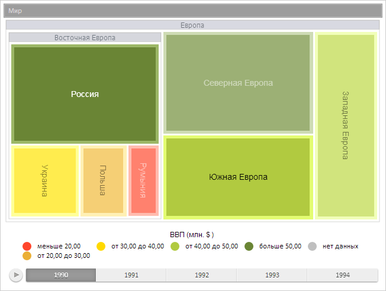

# TreeMap.selectItem

TreeMap.selectItem
-

# TreeMap.selectItem

## Синтаксис

selectItem(item: [PP.Ui.TreeMapItem](../TreeMapItem/TreeMapItem.htm),
 reset: Boolean);

## Параметры

item. Элемент плоского дерева,
 который требуется выделить;

reset. Признак того, что выделения
 элементов плоского дерева будут сброшены. Необязательный параметр. Допустимые
 значения:

	- true. Выделения с элементов
	 будут сброшены;

	- false. Выделения элементов
	 будут оставлены (по умолчанию).

## Описание

Метод selectItem выделяет указанный
 элемент плоского дерева.

## Пример

Для выполнения примера предполагается наличие на странице компонента
 [TreeMap](../../Components/TreeMap/TreeMap.htm) с наименованием
 «treeMap» (см. «[Пример
 создания компонента TreeMap](../../Components/TreeMap/TreeMap_example.htm)»). Определим элементы плоского дерева,
 включающие в себя точки с координатами (150, 150) и (350, 350), а также
 выделим данные элементы:

// Определяем координаты точек
var coords1 = {
    x: 150,
    y: 150
};
var coords2 = {
    x: 300,
    y: 250
};
// Получаем элементы плоского дерева по заданным координатам
var treeMapItem1 = treeMap.getItemOnCoords(coords1.x, coords1.y);
var treeMapItem2 = treeMap.getItemOnCoords(coords2.x, coords2.y);
if (treeMapItem1.isCoordsInner(coords1.x, coords1.y)) {
    console.log("Точка с координатами (%s, %s) принадлежит элементу «%s»",
        coords1.x, coords1.y, treeMapItem1.getCaption());
};
if (treeMapItem2.isCoordsInner(coords2.x, coords2.y)) {
    console.log("Точка с координатами (%s, %s) принадлежит элементу «%s»",
        coords2.x, coords2.y, treeMapItem2.getCaption());
};
// Выделяем первый элемент
treeMap.selectItem(treeMapItem1, true);
// Определяем объект для выделения другого элемента
var items = {};
items[treeMapItem2.getId()] = true;
// Выделяем дополнительно второй элемент
treeMap.selectItems(items, false);
В результате выполнения примера в консоли браузера были выделены элементы
 плоского дерева, соответствующие заданным координатам:

Точка с координатами (150, 150) принадлежит элементу
 «Россия»

Точка с координатами (300, 250) принадлежит элементу
 «Южная Европа»

Данные элементы были выделены:

[TreeMap](TreeMap.htm)

		Справочная
		 система на версию 10.9
		 от 18/08/2025,
		 © ООО «ФОРСАЙТ»,
