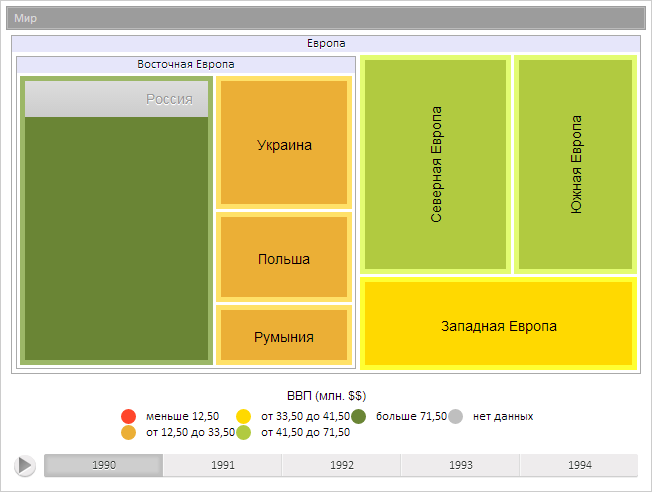

# TreeMapItem.IsLeaf

TreeMapItem.IsLeaf
-

**

# TreeMapItem.IsLeaf

## Синтаксис

IsLeaf: Boolean

## Описание

Свойство IsLeaf** определяет,
 является ли элемент плоского дерева ветвью или листом.

## Комментарии

Значение свойства устанавливается из JSON и с помощью метода set**IsLeaf**,
 а возвращается с помощью метода get**IsLeaf или метода isLeaf.**

Если свойство имеет значение true,
 элемент будет являться листом, иначе - ветвью.

По умолчанию свойство имеет значение true.

## Пример

Для выполнения примера предполагается наличие на странице компонента
 [TreeMap](../../Components/TreeMap/TreeMap.htm) с наименованием
 «treeMap» (см. «[Пример
 создания компонента TreeMap](../../Components/TreeMap/TreeMap_example.htm)» ). Преобразуем в ветвь элемент диаграммы
 с индексом 3, обновим класс элемента:

// Получим элемент диаграммы с индексом 3, который является листом
var item = treeMap.getSceneItems()[3];
// Преобразуем полученный элемент в ветвь
item.setIsLeaf(false);
// Обновим класс элемента
item.updateClass()

В результате выполнения примера элемент диаграммы был преобразован в
 ветвь, был обновлен класс этого элемента:

См. также:

[TreeMapItem](TreeMapItem.htm)

		Справочная
		 система на версию 10.9
		 от 18/08/2025,
		 © ООО «ФОРСАЙТ»,
