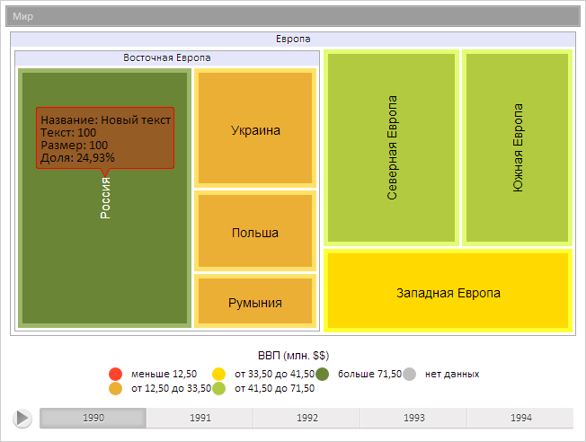

# TreeMapItem.Values

TreeMapItem.Values
-

**

# TreeMapItem.Values

## Синтаксис

Values: Object

## Описание

Свойство Values** определяет значения настроек элемента плоского дерева.

## Комментарии

Значение свойства устанавливается из JSON и с помощью метода set**Values**, а возвращается с помощью метода get**Values**.

## Пример

Для выполнения примера предполагается наличие на странице компонента [TreeMap](../../Components/TreeMap/TreeMap.htm) с наименованием «treeMap» (см. «[Пример создания компонента TreeMap](../../Components/TreeMap/TreeMap_example.htm)» ). Изменим значение настройки имени элемента:

// Получим элемент диаграммы с индексом 3
var item = treeMap.getSceneItems()[3];
// Получим значения настроек элемента диаграммы
var values = item.getValues();
// Изменим значение настройки имени элемента
values.Name = "Новый текст";
// Установим новые значения настроек
item.setValues(values);
// Отобразим всплывающую подсказку
item.showTooltip();

В результате выполнения примера было изменено значение настройки имени элемента:

См. также:

[TreeMapItem](TreeMapItem.htm)

		Справочная
		 система на версию 10.9
		 от 18/08/2025,
		 © ООО «ФОРСАЙТ»,
