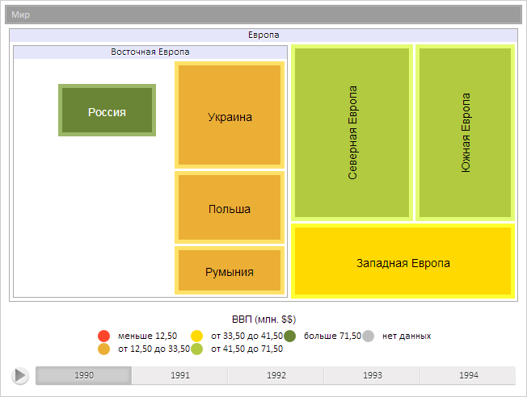

# TreeMapItem.animationStep

TreeMapItem.animationStep
-

**

# TreeMapItem.animationStep

## Синтаксис

animationStep(part: Number);

## Параметры

*part. Шаг анимации.*

## Описание

Метод animationStep** рассчитывает кадр анимации элемента плоского дерева.

## Пример

Для выполнения примера предполагается наличие на странице компонента [TreeMap](../../Components/TreeMap/TreeMap.htm) с наименованием «treeMap» (см. «[Пример создания компонента TreeMap](../../Components/TreeMap/TreeMap_example.htm)» ). Перестроим элемент, установив для него новые целевые значения позиции и размера, рассчитаем кадр анимации и обновим значения позиции и размера элемента:

// Получим элемент диаграммы с индексом 3
var item = treeMap.getSceneItems()[3];
// Определим новое значение позиции и размеров элемента
var position = {Top: 60, Left: 40, Width: 160, Height: 180}
// Перестроим элемент, установив для него новые целевые значения позиции и размера
item.build(position);
// Рассчитаем кадр анимации
item.animationStep(2);
// Обновим позицию элемента
item.updatePosition();

В результате выполнения примера элемент диаграммы был перестроен, для него был рассчитан кадр анимации:

См. также:

[TreeMapItem](TreeMapItem.htm)

		Справочная
		 система на версию 10.9
		 от 18/08/2025,
		 © ООО «ФОРСАЙТ»,
