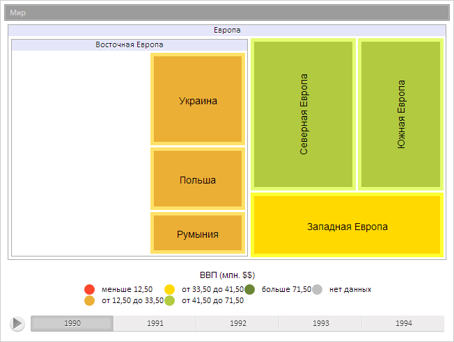
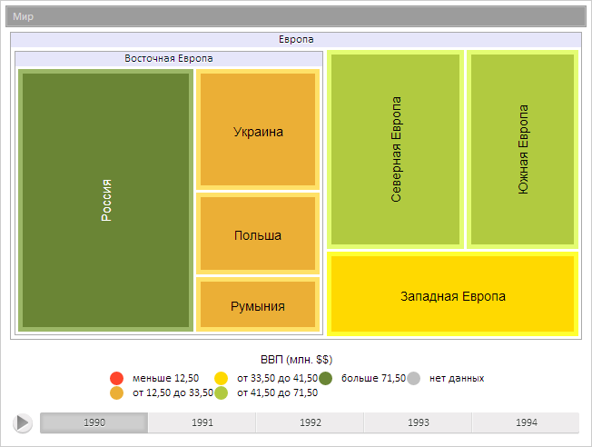

# TreeMapItem.appear

TreeMapItem.appear
-

**

# TreeMapItem.appear

## Синтаксис

appear();

## Описание

Метод appear** отображает
 скрытый элемент плоского дерева.

## Пример

Для выполнения примера предполагается наличие на странице компонента
 [TreeMap](../../Components/TreeMap/TreeMap.htm) с наименованием
 «treeMap» (см. «[Пример
 создания компонента TreeMap](../../Components/TreeMap/TreeMap_example.htm)» ). Скроем элемент диаграммы:

// Получим элемент диаграммы с индексом 3
var item = treeMap.getSceneItems()[3];
// Скроем элемент
item.disappear();
// Перерисуем элемент
item.draw()

В результате был скрыт элемент диаграммы:

Отобразим скрытый элемент:

// Отобразим элемент
item.appear();
// Перерисуем элемент
item.draw();
В результате скрытый элемент диаграммы был отображен:

См. также:

[TreeMapItem](TreeMapItem.htm)

		Справочная
		 система на версию 10.9
		 от 18/08/2025,
		 © ООО «ФОРСАЙТ»,
