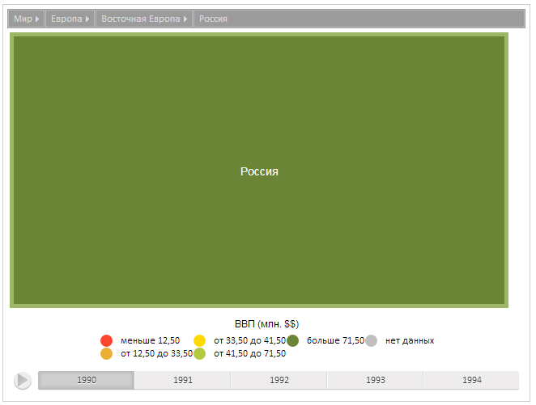

# TreeMapItem.drill

TreeMapItem.drill
-

**

# TreeMapItem.drill

## Синтаксис

drill();

## Описание

Метод drill** переводит плоское дерево к текущему элементу.

## Пример

Для выполнения примера предполагается наличие на странице компонента [TreeMap](../../Components/TreeMap/TreeMap.htm) с наименованием «treeMap» (см. «[Пример создания компонента TreeMap](../../Components/TreeMap/TreeMap_example.htm)» ). Получим элемент с индексом 3 и переведем к нему диаграмму, обновим этот элемент:

// Получим элемент диаграммы с индексом 3
var item = treeMap.getSceneItems()[3];
// Переведем сцену к полученному элементу
item.drill();
// Обновим элемент
item.update();

В результате выполнения примера диаграмма была переведена к полученному элементу, элемент был обновлен:

См. также:

[TreeMapItem](TreeMapItem.htm)

		Справочная
		 система на версию 10.9
		 от 18/08/2025,
		 © ООО «ФОРСАЙТ»,
