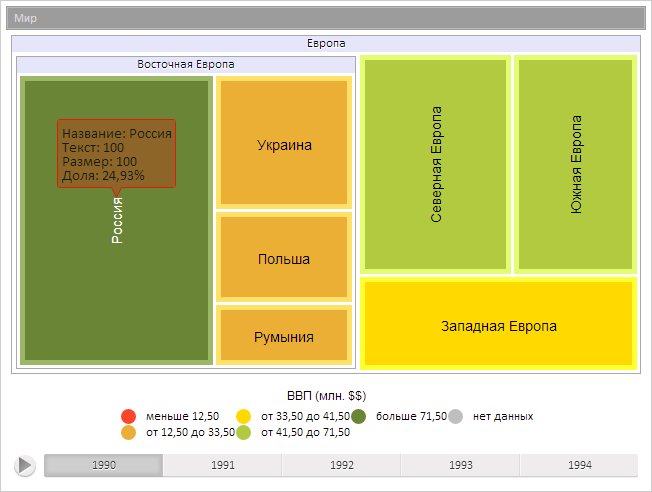
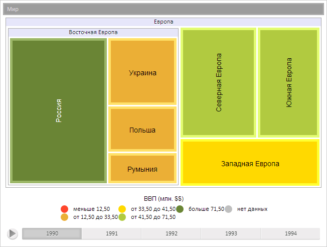

# TreeMapItem.getTooltip

TreeMapItem.getTooltip
-

**

# TreeMapItem.getTooltip

## Синтаксис

getTooltip();

## Описание

Метод getTooltip** возвращает
 объект всплывающей подсказки элемента плоского дерева.

## Комментарии

Метод возвращает значение типа PP.Ui.ChartTooltipBase.

## Пример

Для выполнения примера предполагается наличие на странице компонента
 [TreeMap](../../Components/TreeMap/TreeMap.htm) с наименованием
 «treeMap» (см. «[Пример
 создания компонента TreeMap](../../Components/TreeMap/TreeMap_example.htm)» ). Отобразим всплывающую подсказку элемента
 диаграммы, получим объект подсказки и выведем её координаты, установим
 уровень прозрачность подсказки и обновим её:

// Получим элемент диаграммы с индексом 3
var item = treeMap.getSceneItems()[3];
// Отобразим всплывающую подсказку
item.showTooltip();
// Получим объект всплывающей подсказки
var tooltip = item.getTooltip();
// Выведем координаты элемента подсказки
console.log("Координаты элемента подсказки: (" + tooltip.getTargetX() + "," + tooltip.getTargetY() + ")");
// Установим уровень прозрачность подсказки
tooltip.setOpacity(0.8);
// Обновим настройки всплывающей подсказки элемента и всех его потомков
item.updateTooltipSettings();
// Обновим объект всплывающей подсказки
item.updateTooltip();

В результате была отображена всплывающая подсказка, был изменен уровень
 её прозрачности:

Также в консоли браузера было выведено значение координат всплывающей
 подсказки:

Координаты элемента подсказки: (110.33895382257197,190.5)

Скроем всплывающую подсказку:

// Спрячем всплывающую подсказку
item.hideTooltip();
В результате отображенная раннее всплывающая подсказка была скрыта:

См. также:

[TreeMapItem](TreeMapItem.htm)

		Справочная
		 система на версию 10.9
		 от 18/08/2025,
		 © ООО «ФОРСАЙТ»,
