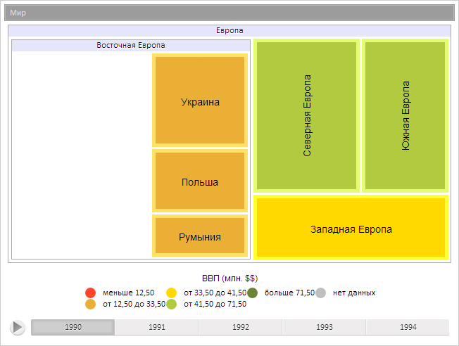

# TreeMapItem.setVisible

TreeMapItem.setVisible
-

**

# TreeMapItem.setVisible

## Синтаксис

setVisible(visible: Boolean);

## Параметры

*visible. Признак*, определяющий видимость элемента плоского дерева. Если значение параметра true, то элемент будет отображен, иначе - скрыт.

## Описание

Метод setVisible** устанавливает видимость объекта.

## Пример

Для выполнения примера предполагается наличие на странице компонента [TreeMap](../../Components/TreeMap/TreeMap.htm) с наименованием «treeMap» (см. «[Пример создания компонента TreeMap](../../Components/TreeMap/TreeMap_example.htm)» ). Скроем элемент диаграммы:

// Получим элемент диаграммы с индексом 3
var item = treeMap.getSceneItems()[3];
// Скроем элемент диаграммы
item.setVisible(false);
// Перерисуем элемент
item.draw();

В результате выполнения примера был скрыт элемент диаграммы:

См. также:

[TreeMapItem](TreeMapItem.htm)

		Справочная
		 система на версию 10.9
		 от 18/08/2025,
		 © ООО «ФОРСАЙТ»,
