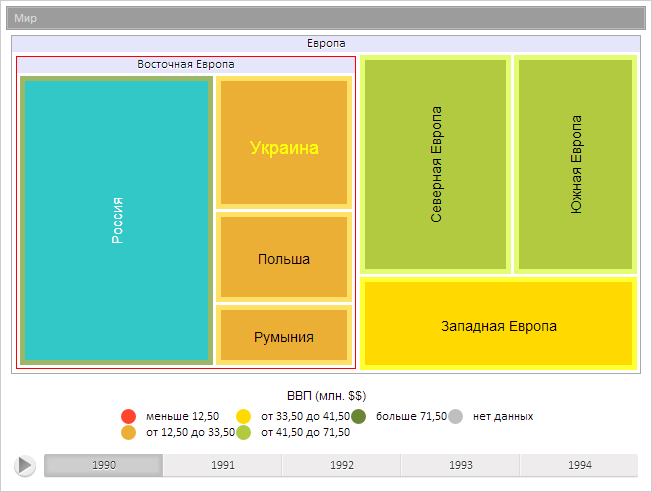
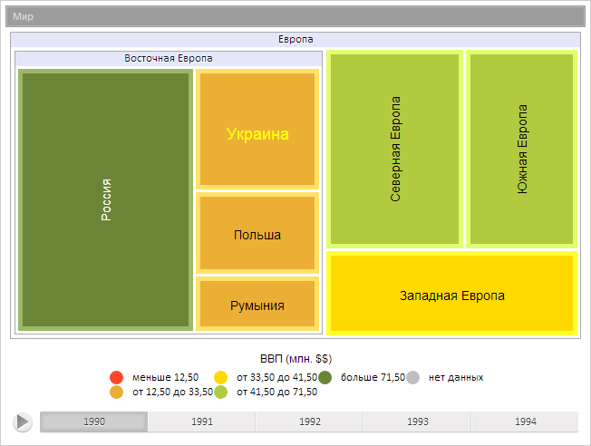

# TreeMapItem.updateBranchColors

TreeMapItem.updateBranchColors
-

**

# TreeMapItem.updateBranchColors

## Синтаксис

updateBranchColors();

## Описание

Метод updateBranchColors**
 обновляет цвета ветви плоского дерева.

## Пример

Для выполнения примера предполагается наличие на странице компонента
 [TreeMap](../../Components/TreeMap/TreeMap.htm) с наименованием
 «treeMap» (см. «[Пример
 создания компонента TreeMap](../../Components/TreeMap/TreeMap_example.htm)» ). Установим новый цвет ветви с индексом
 2, установим новый фоновый цвет листа с индексом 3. Изменим цвет и размер
 шрифта элемента с индексом 4 и обновим его содержимое:

// Получим ветвь диаграммы с индексом 2
var item1 = treeMap.getSceneItems()[2];
// Получим лист диаграммы с индексом 3
var item2 = treeMap.getSceneItems()[3];
// Получим лист диаграммы с индексом 4
var item3 = treeMap.getSceneItems()[4];
// Установим новый цвет границы ветви
item1.getDomNode().style.borderColor = "rgb(255,0,0)";
// Установим новый фоновый цвет
item2.getDomNode().style.backgroundColor = "rgb(50,200,200)";
// Получим стиль элементов диаграммы
var itemsStyle = treeMap.getLabelsStyle();
// Изменим цвет и размер шрифта элементов
itemsStyle.getFont().setColor("#FFFF00");
itemsStyle.getFont().setSize("18");
// Обновим содержимое элемента
item3.updateContent();

В результате был изменен цвет ветви с индексом 2, цвет листа с индексом
 3, также был изменен цвет и размер шрифта элемента с индексом 4:

Обновим цвета ветви с индексом 2 и цвета листа с индексом 3:

// Обновим цвета ветви
item1.updateBranchColors();
// Обновим цвета элемента
item2.updateColors();
В результате значения цветов элементов с индексами 2 и 3 были обновлены
 и сброшены на значения по умолчанию:

См. также:

[TreeMapItem](TreeMapItem.htm)

		Справочная
		 система на версию 10.9
		 от 18/08/2025,
		 © ООО «ФОРСАЙТ»,
