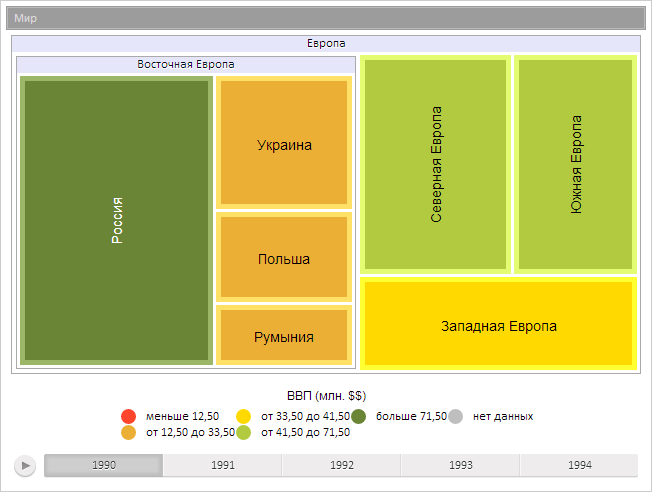

# Пример создания компонента TreeMap

Пример создания компонента TreeMap
-

# Пример создания компонента TreeMap

Для выполнения примера необходимо создать html-страницу и выполнить
 следующие действия:

1. Добавить ссылку на css-файл PP.css.

Также нужно добавить ссылки на следующие js-файлы: PP.js, PP.GraphicsBase.js,
 PP.TreeMap.js, и TreeMapData.js.

Файл TreeMapData.js определяет переменную с наименованием «data», содержащую
 настройки для создания компонента [PP.Ui.TreeMap](TreeMap.htm).

[Содержимое файла
 TreeMapData.js](javascript:TextPopup(this))

var data = {
    "ImagePath": "../build/img/",
    "LeafBorderWidth": "5",
    "LeafPadding": "10",
    "LeavesSpacing": "3",
    "AreHeadersVisible": "true",
    "BranchesOverflow": "Hidden",
    "LeavesOverflow": "Wrap",
    "VerticalContent": "true",
    "AnimationDuration": "5000",
    "HierarchyDepth": "5",
    "BranchSpacing": "4",
    "MaxFont": "14",
    "MinFont": "14",
    "LabelAutoColor": "true",
    "Style": {
        "Release": {
            "Background": {
                "PPType": "PP.SolidColorBrush",
                "Color": "#FFFFFFFF"
            }
        }
    },
    "ItemsTooltipStyle": {
        "HoverMode": "MouseOver",
        "Padding": "2 2 2 2",
        "MaskText": "Название: {%Name} \n Текст: {%TextValue} \n Размер: {%SizeValue} \n Доля: ",
        "TailLength": "10",
        "Offset": "0",
        "Style": {
            "Release": {
                "Background": {
                    "Color": "red",
                    "Opacity": "0.3"
                },
                "Border": {
                    "Color": "red",
                    "Width": "1",
                    "Radius": "2"
                },
                "Font": {
                    "Size": "15"
                }
            }
        },
        "@ShowHandCursor": "false",
        "@Direction": "LeftToRight",
        "@HorizontalAlignment": "Left",
        "@VerticalAlignment": "Top",
        "@Alignment": "Left",
        "@Text": "",
        "@TextWrapping": "NoWrap"
    },
    "LabelsStyle": {
        "Style": {
            "Release": {
                "Font": {
                    "IsItalic": "false",
                    "FontFamily": "Arial",
                    "Size": "11",
                    "IsBold": "false",
                    "Color": "#FF000000"
                }
            }
        },
    },
    "StartHeaderStyle": {
        "@Margin": "0.000000 0.000000 0.000000 0.000000",
        "@Padding": "0.000000 0.000000 0.000000 0.000000",
        "@MaskText": "",
        "@NoDataText": "",
        "@TextWrapping": "NoWrap",
        "@Alignment": "Center",
        "@Direction": "LeftToRight",
        "@ShowHandCursor": "FALSE",
        "Style": {
            "Release": {
                "Font": {
                    "@FontFamily": "Tahoma",
                    "@Color": "#000000",
                    "@Size": "12",
                    "@IsItalic": "FALSE",
                    "@IsBold": "FALSE",
                    "@IsUnderline": "FALSE"
                },
                "Background": {
                    "PPType": "PP.SolidColorBrush",
                    "Color": "#e6e6fa"
                },
                "Border": {
                    "@Style": "solid",
                    "@Color": "#ff9f9f9f",
                    "@Width": "1",
                    "@Radius": "0"
                }
            }
        }
    },
    "EndHeaderStyle": {
        "@Margin": "0.000000 0.000000 0.000000 0.000000",
        "@Padding": "0.000000 0.000000 0.000000 0.000000",
        "@MaskText": "",
        "@NoDataText": "",
        "@TextWrapping": "NoWrap",
        "@Alignment": "Center",
        "@Direction": "LeftToRight",
        "@ShowHandCursor": "FALSE",
        "Style": {
            "Release": {
                "Font": {
                    "@FontFamily": "Tahoma",
                    "@Color": "#003153",
                    "@Size": "12",
                    "@IsItalic": "FALSE",
                    "@IsBold": "FALSE",
                    "@IsUnderline": "FALSE"
                },
                "Background": {
                    "PPType": "PP.SolidColorBrush",
                    "Color": "#c7d0cc"
                },
                "Border": {
                    "@Style": "solid",
                    "@Color": "#ffc1c1c1",
                    "@Width": "1",
                    "@Radius": "0"
                }
            }
        }
    },
    "Model": {
        "RootItem": {
            "Id": "W",
            "Items": [{
                "Id": "EU",
                "Items": [{
                    "Id": "EEU",
                    "Items": [{
                        "Id": "RUS"
                    }, {
                        "Id": "UKR"
                    }, {
                        "Id": "POL"
                    }, {
                        "Id": "ROM"
                    }]
                }, {
                    "Id": "NEU"
                }, {
                    "Id": "SEU"
                }, {
                    "Id": "WEU"
                }]
            }]
        }
    },
    "ItemsNames": {
        "W": "Мир",
        "EU": "Европа",
        "EEU": "Восточная Европа",
        "RUS": "Россия",
        "UKR": "Украина",
        "POL": "Польша",
        "ROM": "Румыния",
        "NEU": "Северная Европа",
        "SEU": "Южная Европа",
        "WEU": "Западная Европа"
    },
    "TextVisual": {
        "TextMapping": {
            "DataSource": "DataSource0",
            "DimAttributeId": "value",
            "Index": "0",
            "Type": "None"
        }
    },
    "ColorVisual": {
        "ColorMapping": {
            "DataSource": "DataSource0",
            "DimAttributeId": "value",
            "Type": "Scale",
            "Index": "0",
            "Scale": "Scale0"
        }
    },
    "HeightVisual": {
        "NumericMapping": {
            "DataSource": "DataSource0",
            "DimAttributeId": "value",
            "Index": "0",
            "Type": "None"
        }
    },
    "SizeVisual": {
        "NumericMapping": {
            "DataSource": "DataSource0",
            "DimAttributeId": "value",
            "Index": "0",
            "Type": "None"
        }
    },
    "DataSources": {
        "DataSource0": {
            "Title": "BubbleTree Data",
            "AttributesNames": {
                "color": "Color Value",
                "radius": "Radius Value",
                "value": "Value"
            },
            "Series": {
                "W": {
                    "value": {
                        "Items": "100 110.0 120.0 130.0 140.0"
                    }
                },
                "EU": {
                    "value": {
                        "Items": "100.0 10.0 20.0 10.0 140.0"
                    }
                },
                "EEU": {
                    "value": {
                        "Items": "100.0 10.0 20.0 10.0 140.0"
                    }
                },
                "RUS": {
                    "value": {
                        "Items": "100.0 10.0 20.0 10.0 140.0"
                    }
                },
                "UKR": {
                    "value": {
                        "Items": "33.0 10.0 81.0 27.0 45.0"
                    }
                },
                "POL": {
                    "value": {
                        "Items": "22.0 10.0 30.0 33.0 34.0"
                    }
                },
                "ROM": {
                    "value": {
                        "Items": "15.0 10.0 28.0 62.0 38.0"
                    }
                },
                "NEU": {
                    "value": {
                        "Items": "53.0 10.0 40.0 35.0 34.0"
                    }
                },
                "SEU": {
                    "value": {
                        "Items": "43.0 10.0 41.0 43.0 45.0"
                    }
                },
                "WEU": {
                    "value": {
                        "Items": "41.0 10.0 41.0 42.0 46.0"
                    }
                }
            }
        }
    },
    "Timeline": {
        "Visibility": "Visible",
        "HorizontalAlignment": "Justify",
        "VerticalAlignment": "Bottom",
        "StepDuration": "500",
        "DelayDuration": "500",
        "ReturnToInitialState": "True",
        "StepsNames": ["1990", "1991", "1992", "1993", "1994"]
    },
    "Breadcrumb": {
        "Height": "24",
        "Margin": "0 0 0 0",
        "Padding": "1 1 0 1",
        "HorizontalAlignment": "Justify",
        "VerticalAlignment": "Top",
        "Style": {
            "Release": {
                "Background": {
                    "Color": "#9C9C9C"
                }
            }
        },
        "ItemStyle": {
            "Margin": "0 0 1 0",
            "Padding": "6 0 0 0",
            "HorizontalAlignment": "Left",
            "VerticalAlignment": "Middle",
            "Style": {
                "Hover": {
                    "Background": {
                        "Color": "#8F8F8F"
                    }
                },
                "Active": {
                    "Background": {
                        "Color": "#787878"
                    }
                },
                "Release": {
                    "Background": {
                        "Color": "#9C9C9C"
                    },
                    "Font": {
                        "IsItalic": "False",
                        "FontFamily": "Arial",
                        "Size": "12",
                        "IsBold": "false",
                        "Color": "#d8d8d8"
                    },
                    "Border": {
                        "Style": "solid",
                        "Color": "#BABABA",
                        "Width": "1"
                    }
                }
            }
        }
    },
    "Scales": {
        "Scale0": {
            "Id": "Scale0",
            "Values": "20.0 30.0 40.0 50.0",
            "Items": "#FFFF462C #FFEBAF36 #FFFFD900 #FFB1CA40 #FF6A8535",
            "EnableEquality": "false",
            "NoData": "#FFBFBFBF",
            "TypeArguments": "Brush"
        }
    },
    "Legends": {
        "Legend0": {
            "Type": "Intervals",
            "Scale": "Scale0",
            "BetweenFormat": "от {0:0.00} до {1:0.00}",
            "GreaterFormat": "больше {0:0.00}",
            "LessFormat": "меньше {0:0.00}",
            "EqualFormat": "ровно {0:0.00}",
            "IncludeEquals": "false",
            "NoDataText": "нет данных",
            "NoDataPosition": "After",
            "NoDataVisible": "true",
            "DoHighlight": "false",
            "Marker": "Circle",
            "Mode": "LessGreater",
            "ColumnCount": "0",
            "TextSpacing": "10",
            "TextWrapping": "NoWrap",
            "IsOuter": "false",
            "IsOverlap": "false",
            "HorizontalAlignment": "Center",
            "VerticalAlignment": "Bottom",
            "Padding": "3 0 3 0",
            "Margin": "6 6 6 6",
            "Header": {
                "Text": "ВВП (млн. $)",
                "Margin": "2 2 2 2",
                "Padding": "2 2 2 2",
                "Style": {
                    "Release": {
                        "Font": {
                            "IsItalic": "False",
                            "FontFamily": "Arial",
                            "Size": "12",
                            "IsBold": "False",
                            "Color": "#FF010000"
                        }
                    }
                }
            }
        }
    }
}

2. Необходимо добавить спрайт с названием «tl_imagelist.png» по адресу
 build/Img.

3. В теге <body> разместить блок с идентификатором «treeMap»
 для хранения созданной диаграммы:

4. Далее в теге <body> необходимо добавить сценарий, создающий
 диаграмму:

В результате выполнения примера на html-странице будет размещен компонент
 [PP.Ui.TreeMap](TreeMap.htm):

См. также:

[TreeMap](TreeMap.htm)

		Справочная
		 система на версию 10.9
		 от 18/08/2025,
		 © ООО «ФОРСАЙТ»,
