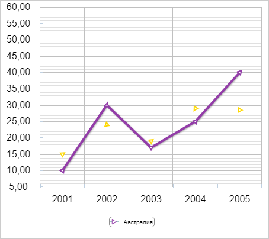

# Chart.AutoRotateMarker

Chart.AutoRotateMarker
-

# Chart.AutoRotateMarker

## Синтаксис

AutoRotateMarker: Boolean;

## Описание

Свойство AutoRotateMarker определяет,
 установлен ли автоматический поворот [маркеров](UiDiagrams.chm::/Tuning_format/Format_line/Markers_Setup.htm)
 на диаграмме.

## Комментарии

Значение свойства задаётся в конструкторе [Chart](Constructor_Chart.htm)
 или с помощью метода setAutoRotateMarker,
 а возвращается с помощью метода getAutoRotateMarker.

Допустимые значения:

	- true. Маркеры автоматически
	 изменяют своё направление по касательной к линии ряда диаграммы;

	- false. По умолчанию.
	 Маркеры располагаются строго вертикально.

Автоматический поворот доступен для [типа
 маркера](UiDiagrams.chm::/Tuning_format/Format_line/Markers_Setup.htm#marker_type) «Треугольник»/«Обратный треугольник» на диаграммах:

	- линейная;

	- точечная;

	- лепестковая;

	- ступенчатая.

В зависимости от изменения значений линейного ряда диаграммы угол наклона
 маркера динамически изменяется.

Для установки автоматического поворота маркеров на конкретных рядах
 данных используйте свойство [ChartCanvasSerie.AutoRotateMarker](../ChartCanvasSerie/ChartCanvasSerie.AutoRotateMarker.htm).

## Пример

Для выполнения примера используйте HTML-код:

<!DOCTYPE html PUBLIC "-//W3C//DTD XHTML 1.0 Transitional//EN" "http://www.w3.org/TR/xhtml1/DTD/xhtml1-transitional.dtd">
<html>
<head>
    <meta http-equiv="X-UA-Compatible" content="IE=edge" />
    <meta http-equiv="Content-Type" content="text/html; charset=UTF-8">
    <title>Chart_Line</title>
    
    
    
    
    <link href="../build/PP.css" rel="stylesheet" type="text/css" />
    

    

    
</head>
<body onload="createChart()">
    

</body>
</html>

В результате выполнения примера на html-странице будет размещена диаграмма
 с автоматическим поворотом маркеров по направлению графика:

См. также:

[Chart](Chart.htm)

		Справочная
		 система на версию 10.9
		 от 18/08/2025,
		 © ООО «ФОРСАЙТ»,
