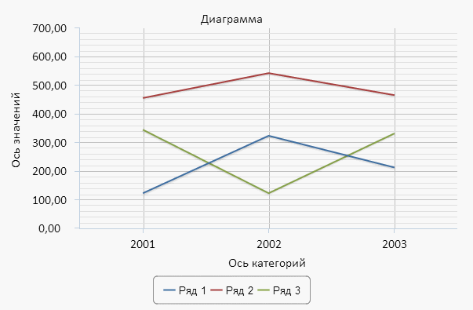

# Chart.ItemsHovered

Chart.ItemsHovered
-

# Chart.ItemsHovered

## Синтаксис

ItemsHovered: function (sender, args);

## Параметры

sender. Источник события;

args. Информация
 о событии. Допустимый аргумент -
 Items. Представляет собой JSON-объект, содержащий
 настройки следующего вида: <индекс ряда, на который наведен
 курсор>: true.

## Описание

Событие ItemsHovered наступает
 при наведении курсора на ряд диаграммы.

## Пример

Для выполнения примера в теге <head> *.html-страницы добавьте
 ссылки на следующие *.js- и *. css-файлы:

	- PP.js;

	- PP.GraphicsBase.js;

	- PP.Charts_Canvas.js;

	- PP.css.

 В теге <body> в качестве значения атрибута «onLoad» укажите
 имя функции для создания диаграммы и добавьте блок с идентификатором «chart»:

<body onload="createChart()">
    

</body>
В теге <script> добавьте код для создания диаграммы:

    // Настройки диаграммы
    var chartOpts =
        {
            Type: "Line", // Линейная диаграмма
            AllowSelect: true,// Разрешено выделение рядов
            Height: 400, // Высота диаграммы
            Width: 600, // Ширина диаграммы
            //Событие выделения рядов
            ItemsSelected: function (sender, args) { console.log(args.Items)},
            //Событие наведения курсора на ряд диаграммы
            ItemsHovered: function (sender, args) { console.log(args.Items)},
            ParentNode: "chart", // Родительский элемент
            // Дополнительная ось значений
            YSAxis:
            {
                Enabled: false // Признак активности дополнительной оси
            },
            //Ось значений
            YAxis:
            {
                // Заголовок оси значений
                Title:
                   {
                       Text: "Ось значений" // Текст заголовка
                   },
               Max: 700, // Максимальное значение оси значений
               Min: 0, // Минимальное значение оси значений
               TickIntervalsCount: 7 // Количество интервалов оси значений
            },
            //Ось категорий
            XAxis:
            {
                Categories: ["2001", "2002", "2003"], // Категории оси
                Enabled: true, //  Признак активности оси категорий
                // Заголовок оси категорий
                Title:
                {
                    Text: "Ось категорий" // Текст заголовка
                },
                // Настройки подписей оси категорий
                Labels:
                {
                    Enabled: true // Признак видимости
                }
            },
            //Ряды данных
            Series:
            [{
                Name: "Ряд 1", // Наименование
                Data: [{ Y: 123 }, { Y: 324 }, { Y: 213 }] // Данные
            },
            {
                Name: "Ряд 2",
                Data: [{ Y: 456 }, { Y: 543 }, { Y: 466 }]
            },
            {
               Name: "Ряд 3",
               Data: [{ Y: 345 }, { Y: 123 }, { Y: 332 }]
            }],
            //Заголовок диаграммы
            Title:
            {
                Text: "Диаграмма" // Текст заголовка
            }
        };
// Диаграмма
 var chart;
 // Создает диаграмму
 function createChart() {
     chart = new PP.Ui.Chart(chartOpts);
 }
После выполнения примера на странице будет размещена диаграмма, имеющая
 следующий вид:

При наведении курсора на ряд диаграммы будет сгенерировано событие ItemsHovered: в консоль браузера
 будет выведен индекс ряда, на который был наведен курсор.

При выделении рядов диаграммы будет сгенерировано событие [ItemsSelected](Chart.ItemsSelected.htm):  в консоль браузера
 будут выведены индексы выделенных рядов.

См. также:

[Chart](Chart.htm)

		Справочная
		 система на версию 10.9
		 от 18/08/2025,
		 © ООО «ФОРСАЙТ»,
