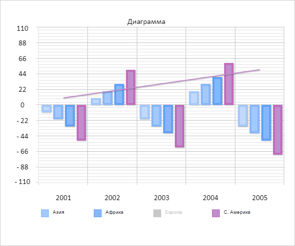

# Chart.ItemsVisibilityChanged

Chart.ItemsVisibilityChanged
-

# Chart.ItemsVisibilityChanged

## Синтаксис

ItemsVisibilityChanged: function(sender, args);

## Параметры

sender. Источник события;

args. Информация о событии.

## Описание

Событие ItemsVisibilityChanged
 наступает при изменении видимости ряда данных диаграммы.

## Пример

Для выполнения примера необходимо наличие на html-странице компонента
 [Chart](../../../Components/Chart/Chart.htm)
 с наименованием «chart» (см. «[Пример
 создания гистограммы](../../../Components/Chart/Chart_Example.htm)»). Добавим обработчик события ItemsVisibilityChanged:

// Устанавливаем обработчик события ItemsVisibilityChanged
chart.ItemsVisibilityChanged.add(function() {
    // Получаем количество рядов данных в виде столбцов без учета невидимых рядов
    var count = chart.getColumnSeriesCount(false);
    // Выводим в консоль браузера полученное значение
    console.log("Количество видимых рядов данных в виде столбцов: " + count);
});
Щелкнем левой кнопкой мыши по одному из маркеров легенды. В результате
 этого действия один из рядов данных легенды был скрыт:

В консоли браузера было выведено количество видимых рядов данных в виде
 столбцов:

Количество видимых рядов данных в виде столбцов:
 4

См. также:

[Chart](Chart.htm)

		Справочная
		 система на версию 10.9
		 от 18/08/2025,
		 © ООО «ФОРСАЙТ»,
