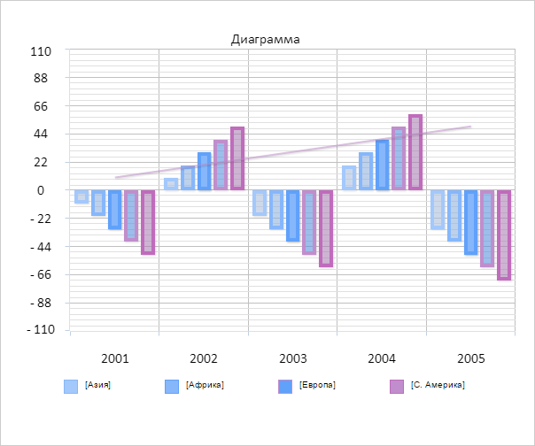

# Chart.LegendFormatter

Chart.LegendFormatter
-

# Chart.LegendFormatter

## Синтаксис

LegendFormatter: Function;

## Описание

Свойство LegendFormatter определяет
 форматирование подписей легенды диаграммы.

## Комментарии

Значение свойства задаётся в конструкторе [Chart](Constructor_Chart.htm)
 или с помощью метода setLegendFormatter,
 а возвращается с помощью метода getLegendFormatter.

## Пример

Для выполнения примера необходимо наличие на html-странице компонента
 [Chart](../../../Components/Chart/Chart.htm)
 с наименованием «chart» (см. «[Пример
 создания гистограммы](../../../Components/Chart/Chart_Example.htm)»). Установим форматирование подписей легенды
 диаграммы:

// Устанавливаем форматирование подписей легенды диаграммы
chart.setLegendFormatter(function(item) {
    return '[' + item.name + ']';
});
// Перерисовываем диаграмму
chart.redraw(true);
В результате выполнения примера для подписей легенды диаграммы были
 добавлены квадратные скобки:

См. также:

[Chart](Chart.htm)

		Справочная
		 система на версию 10.9
		 от 18/08/2025,
		 © ООО «ФОРСАЙТ»,
