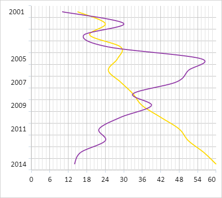

# Chart.MarkersEnabled

Chart.MarkersEnabled
-

# Chart.MarkersEnabled

## Синтаксис

MarkersEnabled: Boolean;

## Описание

Свойство MarkersEnabled определяет
 признак отображения маркеров у рядов данных диаграммы.

## Комментарии

Значение свойства задаётся в конструкторе [Chart](Constructor_Chart.htm)
 или с помощью метода setMarkersEnabled,
 а возвращается с помощью метода getMarkersEnabled.

Допустимые значения:

	- true.
	 По умолчанию. Маркеры у рядов данных диаграммы отображаются;

	- false.
	 Маркеры у рядов данных диаграммы не отображаются.

## Пример

Для выполнения примера необходимо наличие на html-странице компонента
 [Chart](Chart.htm) с наименованием «chart» (см. «[Пример
 создания сглаженной диаграммы](../../../Components/Chart/ChartSplineSerie.htm)»). Скроем маркеры у рядов данных диаграммы:

chart.setMarkersEnabled(false);
// Обновляем маркеры рядов данных диаграммы
updateChartMarkers();
В результате выполнения примера маркеры у рядов данных диаграммы были
 скрыты:

См. также:

[Chart](Chart.htm)

		Справочная
		 система на версию 10.9
		 от 18/08/2025,
		 © ООО «ФОРСАЙТ»,
