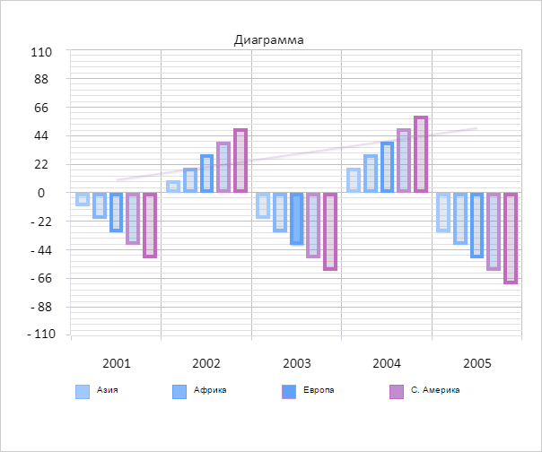

# Chart.Selection

Chart.Selection
-

# Chart.Selection

## Синтаксис

Selection: Object;

## Описание

Свойство Selection определяет
 объект, содержащий информацию о выделенных элементах рядов диаграммы.

## Комментарии

Значение свойства задаётся в конструкторе [Chart](Constructor_Chart.htm),
 а возвращается с помощью метода getSelection.

В объекте должен содержаться массив [Series](Chart.Series.htm),
 состоящий из объектов со следующими полями:

	- Index.
	 Индекс ряда данных, в котором выделены элементы;

	- Points.
	 Массив индексов значений по оси X для выделенных элементов ряда.

## Пример

Для выполнения примера необходимо наличие на html-странице компонента
 [Chart](../../../Components/Chart/Chart.htm)
 с наименованием «chart» (см. «[Пример
 создания гистограммы](../../../Components/Chart/Chart_Example.htm)»). Установим обработчики событий выделения и
 снятия выделения элементов на рядов данных на диаграмме:

// Установим обработчик события выделения рядов данных на диаграмме
chart.Selected.add(function() {
    console.log("Событие Selected");
    // Получим объект выделения
    var selection = chart.getSelection();
    // Получим массив с информацией о выделенных рядах данных
    var series = selection.Series;
    for (var i = 0; i < series.length; i++) {
        // Получим элемент объекта выделения
        var serie = series[i];
        // Выведем в консоль браузера индекс выделенного ряда
        console.log("Ряд данных: " + serie.Index);
        // Получим массив индексов по оси X элементов ряда
        var points = series[i].Points;
        console.log("Категории, в которых выделены данные:");
        // Выведем в консоль браузера категории, в которых выделены элементы ряда
        for (var j = 0; j < points.length; j++) {
            var categorie = chart.getXAxis().getCategories()[points[j]];
            console.log("Категория: " + categorie);
        }
    }
});
// Установим обработчик события снятия выделения рядов данных на диаграмме
chart.Deselected.add(function() {
    console.log("Событие Deselected");
    // Перерисуем ряды данных диаграммы
    var series = chart.getSeries();
    for (var i = 0; i < series.length; i++) {
        series[i].redraw();
    }
});

Удерживая клавишу SHIFT, выделим с помощью указателя мыши один из элементов
 ряда данных на диаграмме:

В результате этого действия в консоли браузера была выведена информация
 о выделенном элементе:

Событие Selected

Ряд данных: 2

Категории, в которых выделены данные:

Категория: 2003

Щелкнем левой кнопкой мыши по любой точки области построения диаграммы.
 В результате этого действия ряды данных диаграммы были перерисованы, после
 чего диаграмма приняла свой первоначальный вид. Также в консоли браузера
 было выведено сообщение о наступлении события Deselected:

Событие Deselected

См. также:

[Chart](Chart.htm)

		Справочная
		 система на версию 10.9
		 от 18/08/2025,
		 © ООО «ФОРСАЙТ»,
