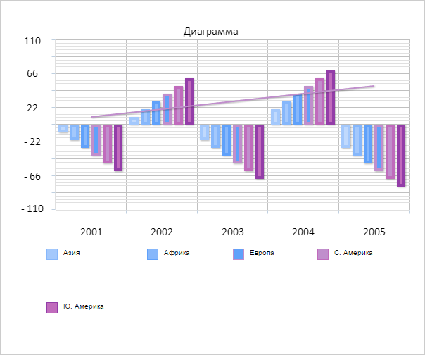

# Chart.addSerie

Chart.addSerie
-

# Chart.addSerie

## Синтаксис

addSerie(options: Object, redraw: Boolean);

## Параметры

options. Настройки ряда данных;

redraw. Признак необходимости
 перерисовки диаграммы.

## Описание

Метод addSerie добавляет новый
 ряд данных на диаграмму.

## Комментарии

Метод возвращает значение типа [PP.Ui.ChartCanvasSerie](../ChartCanvasSerie/ChartCanvasSerie.htm).

Допустимые значения параметра redraw:

	- true.
	 По умолчанию. Необходима перерисовка диаграммы;

	- false.
	 Перерисовка диаграммы не требуется.

## Пример

Для выполнения примера необходимо наличие на html-странице компонента
 [Chart](../../../Components/Chart/Chart.htm)
 с наименованием «chart» (см. «[Пример
 создания гистограммы](../../../Components/Chart/Chart_Example.htm)»). Установим форматирование подписей легенды
 диаграммы:

// Создаем новый ряд данных диаграммы
var serie = new PP.Ui.ChartCanvasSerie({
    Parent: chart, // Родительский элемент
    Type: "Column", // Тип ряда данных
    Index: 5, // Индекс ряда данных
    Name: "Ю. Америка", // Наименование ряда данных
    Data: [-60, 60, -70, 70, -80], // Данные ряда
    Color: "rgb(192,107,188)", // Цвет заливки
    LineColor: "rgb(147,61,168)", // Цвет линий
    LineWidth: 4, // Толщина линий
    ShowInLegend: true // Признак  отображения ряда в легенде
});
// Добавляем ряд на диаграмму
chart.addSerie(serie.getSettings(), true);
В результате выполнения примера на диаграмму был добавлен новый ряд
 данных с наименованием «Ю. Америка»:

См. также:

[Chart](Chart.htm)

		Справочная
		 система на версию 10.9
		 от 18/08/2025,
		 © ООО «ФОРСАЙТ»,
