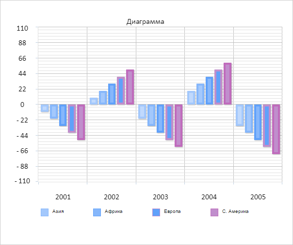

# Chart.getForecastRange

Chart.getForecastRange
-

# Chart.getForecastRange

## Синтаксис

getForecastRange();

## Описание

Метод getForecastRange возвращает
 для диаграммы максимальный прогноз назад и вперед.

## Комментарии

Метод возвращает объект со следующими полями:

	- max.
	 Максимальный прогноз диаграммы вперед;

	- min.
	 Максимальный прогноз диаграммы назад.

## Пример

Для выполнения примера необходимо наличие на html-странице компонента
 [Chart](../../../Components/Chart/Chart.htm)
 с наименованием «chart» (см. «[Пример
 создания гистограммы](../../../Components/Chart/Chart_Example.htm)»). Скроем линии тренда диаграммы и получим для
 диаграммы максимальный прогноз назад и вперед:

// Скрываем линии тренда диаграммы
chart.hideTrendLines(false);
// Получаем для диаграммы максимальный прогноз назад и вперед
var forecastRange = chart.getForecastRange();
// Выводим в консоль браузера максимальный прогноз назад и вперед
console.log("Максимальный прогноз назад: " + forecastRange.min);
console.log("Максимальный прогноз вперед: " + forecastRange.max);
В результате выполнения примера линии тренда диаграммы были скрыты:

В консоли браузера было выведены значения для максимального прогноза
 назад и вперед:

Максимальный прогноз назад: 0

Максимальный прогноз вперед: 4

См. также:

[Chart](Chart.htm)

		Справочная
		 система на версию 10.9
		 от 18/08/2025,
		 © ООО «ФОРСАЙТ»,
