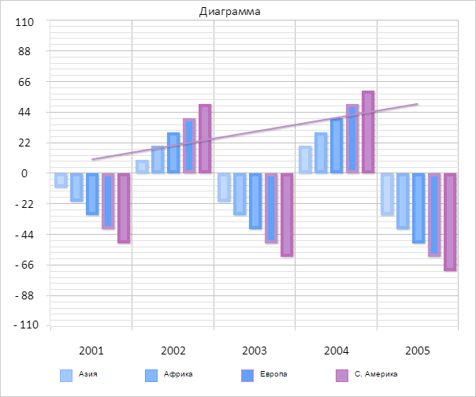

# Chart.getPaddings

Chart.getPaddings
-

# Chart.getPaddings

## Синтаксис

getPaddings();

## Описание

Метод getPaddings возвращает
 объект, содержащий отступы диаграммы.

## Комментарии

Метод возвращает объект, в котором содержатся следующие поля:

	- Bottom.
	 Нижний отступ диаграммы;

	- Left.
	 Левый отступ диаграммы;

	- Right.
	 Правый отступ диаграммы;

	- Top.
	 Верхний отступ диаграммы.

Поля возвращаемого объекта имеют тип Number.

Значения отступов устанавливаются с помощью следующих свойств:

	- [Chart.PaddingBottom](Chart.PaddingBottom.htm).
	 Свойство PaddingBottom определяет
	 нижний отступ диаграммы;

	- [Chart.PaddingLeft](Chart.PaddingLeft.htm).
	 Свойство PaddingLeft определяет
	 левый отступ диаграммы;

	- [Chart.PaddingRight](Chart.PaddingRight.htm).
	 Свойство PaddingRight определяет
	 правый отступ диаграммы;

	- [Chart.PaddingTop](Chart.PaddingTop.htm).
	 Свойство PaddingTop определяет
	 верхний отступ диаграммы.

## Пример

Для выполнения примера необходимо наличие на html-странице компонента
 [Chart](../../../Components/Chart/Chart.htm)
 с наименованием «chart» (см. «[Пример
 создания гистограммы](../../../Components/Chart/Chart_Example.htm)»). Получим информацию об отступах и размерах
 диаграммы:

// Получаем объект с размерами и отступами диаграммы с учетом только размеров и отступов DOM-элемента
var borders = chart.getOriginalPlotBorders();
// Выводим в консоль браузера информацию о диаграмме
console.log("Координаты левого верхнего угла диаграммы: (" + borders.X + ";" + borders.Y + ")");
console.log("Ширина диаграммы: " + borders.W);
console.log("Высота диаграммы: " + borders.H);
// Получаем объект, содержащий отступы диаграммы
var paddings = chart.getPaddings();
// Получаем объект, содержащий признаки применения отступов диаграммы
var paddingWasApplied = chart.getPaddingWasApplied();
// Выводим в консоль браузера информацию об отступах диаграммы
var leftWasApplied = paddingWasApplied.Left ? "да" : "нет";
var rightWasApplied = paddingWasApplied.Right ? "да" : "нет";
var topWasApplied = paddingWasApplied.Top ? "да" : "нет";
var bottomWasApplied = paddingWasApplied.Bottom ? "да" : "нет";
console.log("Левый отступ: " + paddings.Left + " Применен на диаграмме? " + leftWasApplied);
console.log("Правый отступ: " + paddings.Right + " Применен на диаграмме? " + rightWasApplied);
console.log("Верхний отступ: " + paddings.Top + " Применен на диаграмме? " + topWasApplied);
console.log("Нижний отступ: " + paddings.Bottom + " Применен на диаграмме? " + bottomWasApplied);
В результате выполнения примера в консоли браузера были выведены размеры
 диаграммы, координаты левого верхнего угла диаграммы, а также значения
 отступов диаграммы, а также признаки применения отступов на диаграмме:

Координаты левого верхнего угла диаграммы: (77.4609375;54)

Ширина диаграммы: 502.5390625 VM2536:6

Высота диаграммы: 318

Левый отступ: 15 Применен на диаграмме? да

Правый отступ: 20 Применен на диаграмме? да

Верхний отступ: 30 Применен на диаграмме? да

Нижний отступ: 40 Применен на диаграмме? да

Установим признак использования альтернативного расчета отступов, перерисуем
 диаграмму и выведем в консоль браузера признаки применения отступов на
 диаграмме:

// Устанавливаем признак использования альтернативного расчета отступов
chart.setUseSoftPadding(true);
console.log("Применение альтернативного расчета отступов диаграммы");
// Перерисовываем диаграмму
chart.redraw(true);
// Повторно получаем объект, содержащий признаки применения отступов диаграммы
paddingWasApplied = chart.getPaddingWasApplied();
// Выводим в консоль браузера информацию об отступах диаграммы после применения альтернативного расчета отступов
leftWasApplied = paddingWasApplied.Left ? "да" : "нет";
rightWasApplied = paddingWasApplied.Right ? "да" : "нет";
topWasApplied = paddingWasApplied.Top ? "да" : "нет";
bottomWasApplied = paddingWasApplied.Bottom ? "да" : "нет";
console.log("Левый отступ применен на диаграмме? " + leftWasApplied);
console.log("Правый отступ применен на диаграмме? " + rightWasApplied);
console.log("Верхний отступ применен на диаграмме? " + topWasApplied);
console.log("Нижний отступ применен на диаграмме? " + bottomWasApplied);
В результате выполнения примера диаграмма была перерисована без применения
 левого, верхнего и нижнего отступов:

В консоли браузера было выведено сообщение о применении альтернативного
 расчета отступов, а также обновленные значения признаков применения отступов
 диаграммы:

Применение альтернативного расчета отступов диаграммы

Левый отступ применен на диаграмме? нет

Правый отступ применен на диаграмме? да

Верхний отступ применен на диаграмме? нет

Нижний отступ применен на диаграмме? нет

См. также:

[Chart](Chart.htm)

		Справочная
		 система на версию 10.9
		 от 18/08/2025,
		 © ООО «ФОРСАЙТ»,
