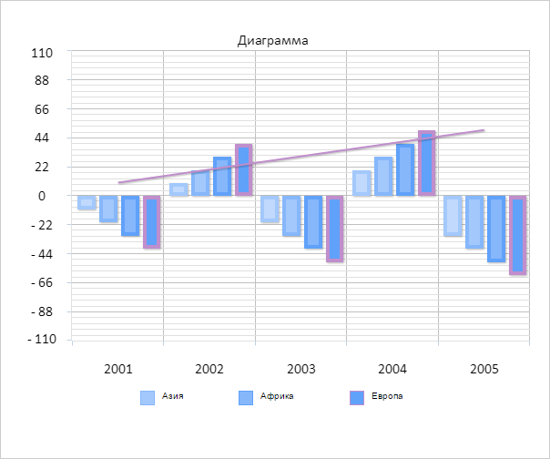
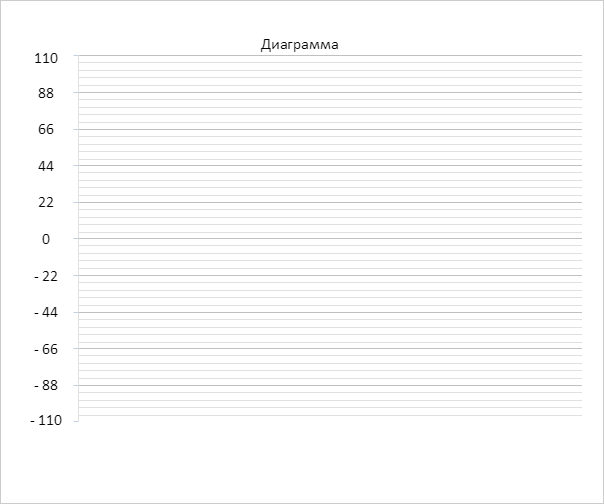

# Chart.removeAllSeries

Chart.removeAllSeries
-

# Chart.removeAllSeries

## Синтаксис

removeAllSeries(redraw: Boolean);

## Параметры

redraw. Признак необходимости
 перерисовки диаграммы.

## Описание

Метод removeAllSeries удаляет
 все ряды данных диаграммы.

## Комментарии

Допустимые значения параметра redraw:

	- true. По умолчанию.
	 Необходима перерисовка диаграммы;

	- false. Перерисовка диаграммы
	 не требуется.

## Пример

Для выполнения примера необходимо наличие на html-странице компонента
 [Chart](../../../Components/Chart/Chart.htm)
 с наименованием «chart» (см. «[Пример
 создания гистограммы](../../../Components/Chart/Chart_Example.htm)»). Удалим один из рядов данных диаграммы:

// Получаем ряды диаграммы
var series = chart.getSeries();
// Выводим в консоль браузера количество рядов диаграммы
console.log("Количество рядов диаграммы: " + series.length);
// Проверяем наличие рядов данных на диаграмме
if (series.length > 0) {
    //Получаем последний ряд диаграммы
    var serie = chart.getSerie(chart.getSeries().length - 1);
    // Удаляем полученный ряд без перерисовки диаграммы
    chart.removeSerie(serie, false);
    // Выводим в консоль браузера количество рядов диаграммы после удаления ряда
    console.log("Количество рядов диаграммы после удаления ряда: " + chart.getSeries().length);
    // Перерисовываем диаграмму
    chart.redraw(true);
}
В результате выполнения примера из массива рядов диаграммы был удален
 последний ряд данных:

В консоли браузера были выведены сообщения о количестве рядов данных
 диаграммы до и после удаления ряда:

Количество рядов диаграммы: 5

Количество рядов диаграммы после удаления ряда:
 4

Удалим все ряды данных диаграммы:

// Удаляем все ряды данных на диаграмме
chart.removeAllSeries();
В результате этого действия на экране будет отображена диаграмма, в
 которой отсутствуют ряды данных:

См. также:

[Chart](Chart.htm)

		Справочная
		 система на версию 10.9
		 от 18/08/2025,
		 © ООО «ФОРСАЙТ»,
