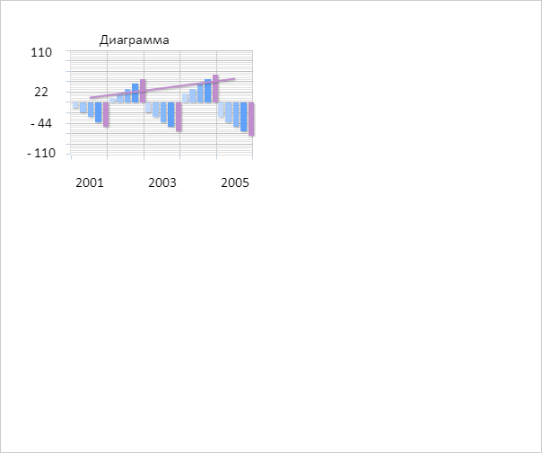

# Chart.resize

Chart.resize
-

# Chart.resize

## Синтаксис

resize(width: Number, height: Number, noAnimation:
 Boolean);

## Параметры

width. Ширина диаграммы;

height. Высота диаграммы;

noAnimation. Признак использования
 анимации при перерисовке диаграммы.

## Описание

Метод resize изменяет размеры
 диаграммы.

## Комментарии

Допустимые значения параметра noAnimation:

	- true. Анимация используется;

	- false. По умолчанию.
	 Анимация не используется.

## Пример

Для выполнения примера необходимо наличие на html-странице компонента
 [Chart](../../../Components/Chart/Chart.htm)
 с наименованием «chart» (см. «[Пример
 создания гистограммы](../../../Components/Chart/Chart_Example.htm)»). Изменим размеры диаграммы:

// Проверяем, можно ли в данный момент изменять размеры диаграммы
if(!chart.getIsResizing()){
// Изменяем размеры диаграммы
chart.resize(chart.getWidth()/2, chart.getHeight()/2, false);
}
В результате выполнения примера на экране была отображена диаграмма,
 ширина и высота которой были уменьшены в 2 раза:

См. также:

[Chart](Chart.htm)

		Справочная
		 система на версию 10.9
		 от 18/08/2025,
		 © ООО «ФОРСАЙТ»,
