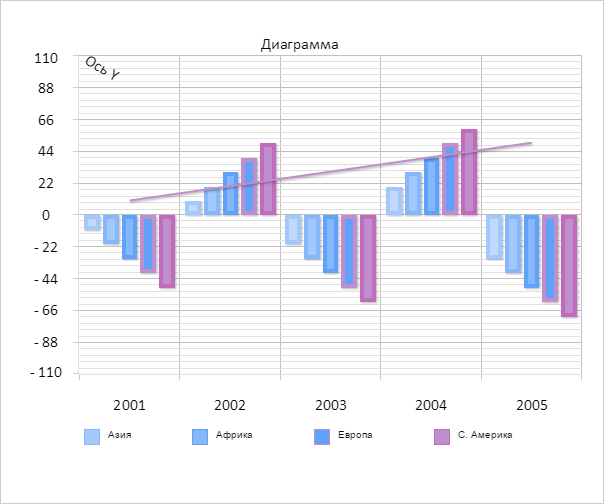

# ChartAxisTick.setAngle

ChartAxisTick.setAngle
-

# ChartAxisTick.setAngle

## Синтаксис

setAngle(value: Number);

## Параметры

value. Угол поворота подписи.

## Описание

Метод setAngle устанавливает
 угол поворота подписи.

## Пример

Для выполнения примера необходимо наличие экземпляра класса [ChartAxisTick](ChartAxisTick.htm)
 с наименованием «axisTick» (см. «[Конструктор
 ChartAxisTick](Constructor_ChartAxisTick.htm)»). Установим угол поворота подписи и отобразим ее:

// Устанавливаем угол поворота подписи
axisTick.setAngle(30);
// Перерисовываем диаграмму
chart.redraw();
// Отрисовываем подпись
axisTick.drawSelf();
В результате подпись была отрисована под углом:

Получим длину подписи под углом:

// Получаем длину подписи под углом
console.log("Длина подписи под углом: " + axisTick.getAngleSize(30*Math.PI/180));
Длина подписи под углом: 67.07367219082653

См. также:

[ChartAxisTick](ChartAxisTick.htm)

		Справочная
		 система на версию 10.9
		 от 18/08/2025,
		 © ООО «ФОРСАЙТ»,
