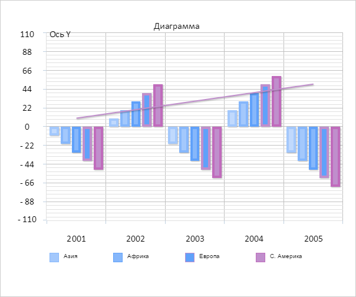

# Конструктор ChartAxisTick

Конструктор ChartAxisTick
-

# Конструктор ChartAxisTick

## Синтаксис

PP.Ui.ChartAxisTick(settings);

## Параметры

settings. JSON-объект со значениями
 свойств компонента.

## Описание

Конструктор ChartAxisTick создает
 экземпляр класса [ChartAxisTick](ChartAxisTick.htm).

## Пример

Для выполнения примера необходимо наличие на html-странице компонента
 [Chart](../../../Components/Chart/Chart.htm) с наименованием
 «chart» (см. «[Пример
 создания компонента Chart](../../../Components/Chart/Chart_Example.htm)»). Создадим подпись оси и отрисуем ее:

// Создаем метку оси диаграммы
var axisTick = new PP.Ui.ChartAxisTick({
    Parent: chart.getYAxis(),
    Left: 100,
    Top: 10,
    AxisValue: chart.getYAxis().getAxisValue()
});
// Устанавливаем текстовое значение метке
axisTick.setText("Ось Y");
// Устанавливаем максимальную ширину подписи
axisTick.setMaxWidth(60);
// Отрисовываем метку
axisTick.drawSelf();
В результате на диаграмме была отрисованна подпись оси:

Проверим, выходит ли текстовое значение за границы заданной максимальной
 ширины:

// Проверяем, выходит ли текстовое значение за границы заданной максимальной
if (axisTick.getOverflow()) {
    console.log("Текстовое значение выходит за границы максимальной ширины");
} else {
    console.log("Текстовое значение не выходит за границы максимальной ширины");
}
В результате в консоль был выведен результат проверки:

Текстовое значение не выходит за границы максимальной
 ширины

См. также:

[ChartAxisTick](ChartAxisTick.htm)

		Справочная
		 система на версию 10.9
		 от 18/08/2025,
		 © ООО «ФОРСАЙТ»,
