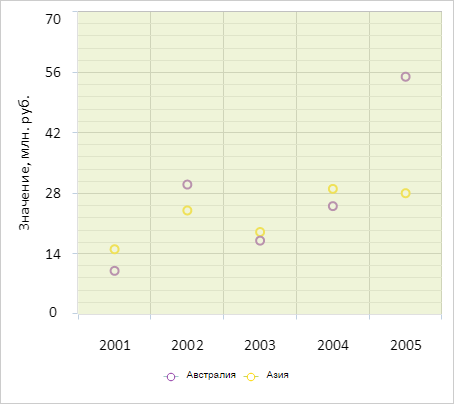

# ChartCanvasAxis.DrawContext

ChartCanvasAxis.DrawContext
-

# ChartCanvasAxis.DrawContext

## Синтаксис

DrawContext: CanvasRenderingContext2D;

## Описание

Свойство DrawContext определяет
 контекст рисования оси диаграммы.

## Комментарии

Свойство предназначено только для чтения.

## Пример

Для выполнения примера необходимо наличие на html-странице компонента
 [Chart](../../../Components/Chart/Chart.htm) с наименованием
 «chart» (см. «[Пример
 создания точечной диаграммы](../../../Components/Chart/ChartScatter.htm)»). Установим новый цвет заливки для области
 построения диаграммы:

// Получаем ось Y диаграммы
var yAxis = chart.getYAxis();
// Получаем размеры и отступы области построения диаграммы
var plotBorders = yAxis.getPlotBorders();
// Получаем контекст рисования оси диаграммы
var context = yAxis.getDrawContext();
// Изменяем цвет заливки данной области
context.fillStyle = "rgb(223,233,178)";
context.globalAlpha = 0.5;
context.fillRect(plotBorders.X, plotBorders.Y, plotBorders.W, plotBorders.H);
В результате выполнения примера для области построения диаграммы был
 установлен новый цвет заливки:

См. также:

[ChartCanvasAxis](ChartCanvasAxis.htm)

		Справочная
		 система на версию 10.9
		 от 18/08/2025,
		 © ООО «ФОРСАЙТ»,
