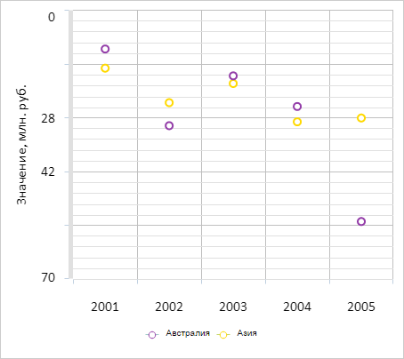

# ChartCanvasAxis.Inverted

ChartCanvasAxis.Inverted
-

# ChartCanvasAxis.Inverted

## Синтаксис

Inverted: Boolean;

## Описание

Свойство Inverted определяет
 признак того, что ось диаграммы инвертирована.

## Комментарии

Значение свойства устанавливается из JSON, а возвращается с помощью
 метода getInverted.

Допустимые значения:

	- true.
	 Ось диаграммы инвертирована;

	- false.
	 Ось диаграммы не инвертирована (по умолчанию).

## Пример

Для выполнения примера необходимо наличие на html-странице компонента
 [Chart](../../../Components/Chart/Chart.htm)
 с наименованием «chart» (см. «[Пример
 создания гистограммы](../../../Components/Chart/Chart_Example.htm)»). Инвертируем ось Y диаграммы и установим толщину
 её линии:

// Получаем ось Y диаграммы
var axis = chart.getYAxis();
var settings = axis.getSettings();
// Инвертируем данную ось
settings.Inverted = true;
// Устанавливаем толщину оси
settings.LineWidth = 5;
axis.setSettings(settings);
// Перерисовываем диаграмму
chart.redraw(true);
В результате выполнения примера ось Y диаграммы была инвертирована,
 а для её линии установлена толщина, равная 5 пикселям:

См. также:

[ChartCanvasAxis](ChartCanvasAxis.htm)

		Справочная
		 система на версию 10.9
		 от 18/08/2025,
		 © ООО «ФОРСАЙТ»,
