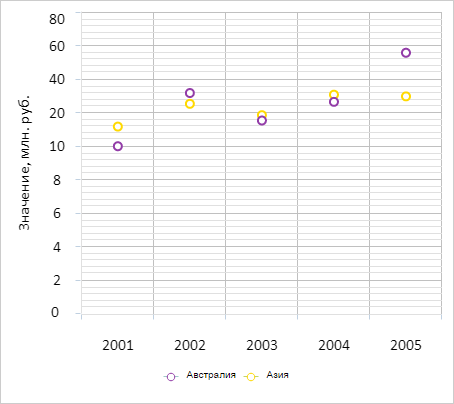

# ChartCanvasAxis.IsLogarithmic

ChartCanvasAxis.IsLogarithmic
-

# ChartCanvasAxis.IsLogarithmic

## Синтаксис

IsLogarithmic: Boolean;

## Описание

Свойство IsLogarithmic определяет
 признак того, является ли ось диаграммы логарифмической.

## Комментарии

Значение свойства устанавливается из JSON и возвращается с помощью метода
 getIsLogarithmic.

Допустимые значения:

	- true.
	 Ось является логарифмической;

	- false.
	 Ось является арифметической (по умолчанию).

## Пример

Для выполнения примера необходимо наличие на html-странице компонента
 [Chart](../../../Components/Chart/Chart.htm) с наименованием
 «chart» (см. «[Пример
 создания точечной диаграммы](../../../Components/Chart/ChartScatter.htm)»). Сделаем ось Y логарифмической:

// Получаем ось Y диаграммы
var yAxis = chart.getYAxis();
// Указываем, что ось является логарифмической
var settings = yAxis.getSettings();
settings.IsLogarithmic = true;
yAxis.setSettings(settings);
// Перерисовываем диаграмму
chart.redraw(true);
В результате выполнения примера ось Y стала логарифмической:

См. также:

[ChartCanvasAxis](ChartCanvasAxis.htm)

		Справочная
		 система на версию 10.9
		 от 18/08/2025,
		 © ООО «ФОРСАЙТ»,
