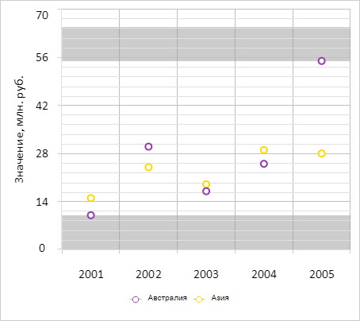

# ChartCanvasAxis.PlotBands

ChartCanvasAxis.PlotBands
-

# ChartCanvasAxis.PlotBands

## Синтаксис

PlotBands: Array;

## Описание

Свойство PlotBands определяет
 массив пользовательских областей оси диаграммы.

## Комментарии

Значение свойства устанавливается из JSON и возвращается с помощью метода
 getPlotBands.

## Пример

Для выполнения примера необходимо наличие на html-странице компонента
 [Chart](../../../Components/Chart/Chart.htm) с наименованием
 «chart» (см. «[Пример
 создания точечной диаграммы](../../../Components/Chart/ChartScatter.htm)»). Добавим две пользовательские области
 для оси Y:

// Возвращает цвет пользовательской оси диаграммы
function getPlotBandColor() {
    var plotBandColor = new PP.SolidColorBrush({
        Color: "#999",
        Opacity: 0.5
    });
    return plotBandColor;
}
// Создаёт первую пользовательскую область оси диаграммы
function createPlotBand1(axis) {
    var plotBand1 = {
        From: axis.getRoundedMin(),
        To: axis.getDataExtremes().min,
        BackgroundColor: getPlotBandColor(),
        disableEditBand: true,
        DisableBand: true
    };
    return plotBand1;
}
// Создаёт вторую пользовательскую область оси диаграммы
function createPlotBand2(axis) {
    var plotBand2 = {
        From: axis.getRoundedMax() - 5,
        To: axis.getRoundedMax(),
        BackgroundColor: getPlotBandColor(),
        disableEditBand: true,
        DisableBand: true
    };
    return plotBand2;
}
// Получаем ось Y диаграммы
var yAxis = chart.getYAxis();
// Вычисляем минимальное и максимальное значения оси Y
yAxis.getSeriesExtremes();
// Получаем и устанавливаем первую пользовательскую область оси диаграммы
var plotBand1 = createPlotBand1(yAxis);
if (yAxis.getPlotBands()) {
    yAxis.getPlotBands().push(plotBand1);
}
// Получаем и устанавливаем вторую пользовательскую область оси диаграммы
var plotBand2 = createPlotBand2(yAxis);
yAxis.addPlotBand(plotBand2);
// Перерисовываем область
chart.redraw(true);
В результате выполнения примера были созданы две пользовательские области
 для оси Y, ограничивающие область с точками рядов данных:

Теперь удалим пользовательские области оси Y:

// Удаляет пользовательские области оси диаграммы
function removePlotBands(axis) {
        for (var i = axis.getPlotBands().length - 1; i >= 0; i--) {
            var plotBand = axis.getPlotBands()[i];
            axis.removePlotBand(plotBand);
        }
    }
    // Получаем ось Y диаграммы
var yAxis = chart.getYAxis();
// Удаляем пользовательские области оси диаграммы
removePlotBands(yAxis);
// Перерисовываем диаграмму
chart.redraw(true);
В результате выполнения примера были удалены все пользовательские области
 оси Y:

См. также:

[ChartCanvasAxis](ChartCanvasAxis.htm)

		Справочная
		 система на версию 10.9
		 от 18/08/2025,
		 © ООО «ФОРСАЙТ»,
