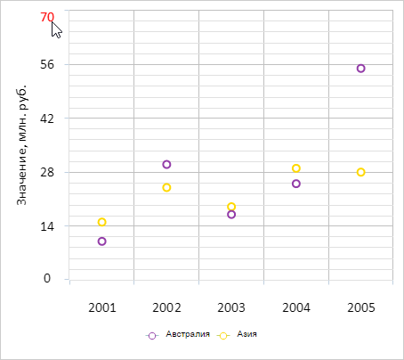
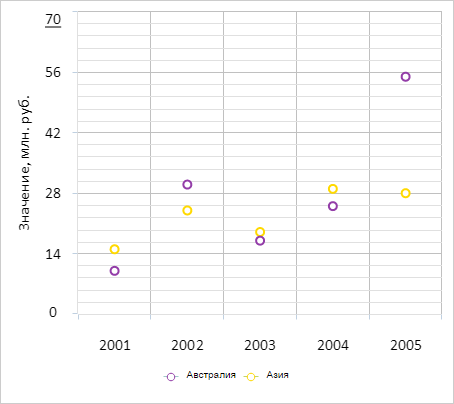

# ChartCanvasAxis.checkMouseCoords

ChartCanvasAxis.checkMouseCoords
-

# ChartCanvasAxis.checkMouseCoords

## Синтаксис

checkMouseCoords(coords: Object, event: MouseEvent);

## Параметры

coords. Координаты, соответствующие
 текущему положению указателя мыши над диаграммой;

event. Событие мыши.

## Описание

Метод checkMouseCoords проверяет
 попадание указателя мыши на подписи оси диаграммы и вызывает соответствующие
 события.

## Комментарии

При наведении указателем на подпись оси диаграммы метод генерирует событие
 [ChartCanvasAxis.LabelMouseOver](ChartCanvasAxis.LabelMouseOver.htm),
 при наведении на подпись - событие [ChartCanvasAxis.LabelMouseOut](ChartCanvasAxis.LabelMouseOut.htm).

## Пример

Для выполнения примера необходимо наличие на html-странице компонента
 [Chart](../../../Components/Chart/Chart.htm) с наименованием
 «chart» (см. «[Пример
 создания точечной диаграммы](../../../Components/Chart/ChartScatter.htm)»). Обработаем события перемещения указателя
 мыши и нажатия правой кнопки:

// Получаем ось Y диаграммы
var yAxis = chart.getYAxis();
// Обрабатывает перемещение указателя мыши
function onMouseMove(sender, args) {
    var coord = {
        X: args.Event.x,
        Y: args.Event.y
    };
    yAxis.checkMouseCoords(coord, args.Event);
};
// Обрабатывает нажатие на подпись оси диаграммы
function onLabelClick(sender, args) {
    var coords = {
        X: args.Event.x,
        Y: args.Event.y
    };
    var ticks = yAxis.getticks();
    for (var i = 0; i < ticks.length; i++) {
        if (coords.X >= ticks[i].getLeft() - ticks[i].getWidth() / 4 * 3 &&
            coords.X <= ticks[i].getLeft() + ticks[i].getWidth() / 4 * 3 &&
            coords.Y >= ticks[i].getTop() - ticks[i].getHeight() / 4 * 3 &&
            coords.Y <= ticks[i].getTop() + ticks[i].getHeight() / 4 * 3) {
            yAxis.LabelClick.fire(yAxis, {
                Tick: ticks[i],
                Event: event
            });
        }
    }
}
// Добавляем обработчик события перемещения указателя мыши
chart.addEvent(chart.getDomNode(), "mousemove", onMouseMove);
// Добавляем обработчик события нажатия кнопки мыши
chart.addEvent(chart.getDomNode(), "click", onLabelClick);
В результате выполнения примера подписи оси диаграммы при наведении
 на них указателем мыши окрашиваются в красный цвет, при покидании - в
 чёрный:

После щелчка мышью подпись оси диаграммы подчёркивается:

См. также:

[ChartCanvasAxis](ChartCanvasAxis.htm)

		Справочная
		 система на версию 10.9
		 от 18/08/2025,
		 © ООО «ФОРСАЙТ»,
