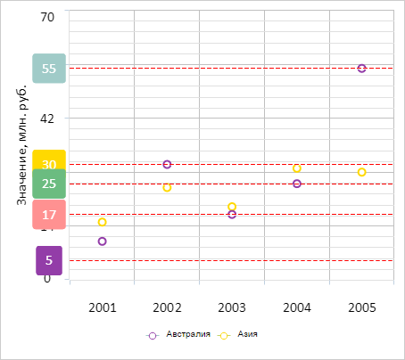
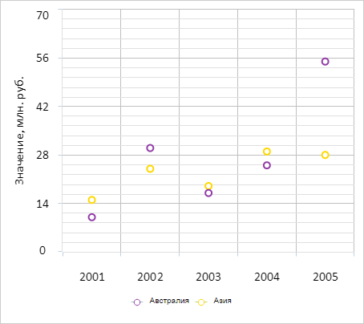

# ChartCanvasAxis.drawVisualLines

ChartCanvasAxis.drawVisualLines
-

# ChartCanvasAxis.drawVisualLines

## Синтаксис

drawVisualLines(points: Array, lineOptions: Object,
 drawLine: Boolean, customValue: Number, redraw: Boolean);

## Параметры

points. Массив точек ряда данных
 диаграммы;

lineOptions. Настройки линий
 оси. Необязательный параметр. В качестве значения принимает JSON-объект
 со следующими полями: LineColor - цвет линии, LineWidth - толщина линии,
 LineStyle - стиль линии;

drawLine. Признак отрисовки
 линий оси. Необязательный параметр. Допустимые значения:

	- true.
	 Линии оси будут отрисованы;

	- false.
	 Линии оси не будут отрисованы (по умолчанию);

customValue. Определённое пользователем
 значение, для которого будет дополнительно отрисована линия. Необязательный
 параметр;

redraw. Признак перерисовки
 оси диаграммы. Необязательный параметр. Допустимые значения:

	- true.
	 Ось диаграммы будет перерисована;

	- false.
	 Ось диаграммы не будет перерисована (по умолчанию).

## Описание

Метод drawVisualLines отрисовывает
 линии оси для указанных точек ряда данных диаграммы.

## Пример

Для выполнения примера необходимо наличие на html-странице компонента
 [Chart](../../../Components/Chart/Chart.htm) с наименованием
 «chart» (см. «[Пример
 создания точечной диаграммы](../../../Components/Chart/ChartScatter.htm)»). Отрисуем для точек первого ряда данных
 диаграммы линии оси Y:

// Рисует линии оси для каждой точки первого ряда данных
function drawVisualLines(axis, serie) {
    // Получаем точки ряда данных
    var points = serie.getPoints();
    // Определяем настройки линий
    var lineOptions = {
        LineColor: "rgb(255, 0, 0)",
        LineWidth: 1,
        LineStyle: "dash"
    };
    /* Отрисовываем линии на оси для каждой точки первого ряд данных,
	а также для точки со значением 5 */
    axis.drawVisualLines(points, lineOptions, true, 5, true);
}
// Получаем ось Y диаграммы
var yAxis = chart.getYAxis();
// Получаем первый ряд данных
var serie = chart.getSerie(0);
// Отрисовываем линии оси Y для каждой точки первого ряд данных
drawVisualLines(yAxis, serie);
В результате выполнения примера для каждой точки первого ряда данных
 были отрисованы линии оси Y. Также специально была нарисована линия для
 значения 5:

Теперь удалим линии оси Y:

yAxis.removeVisualLines(true);
После выполнения примера все линии оси Y были удалены:

См. также:

[ChartCanvasAxis](ChartCanvasAxis.htm)

		Справочная
		 система на версию 10.9
		 от 18/08/2025,
		 © ООО «ФОРСАЙТ»,
