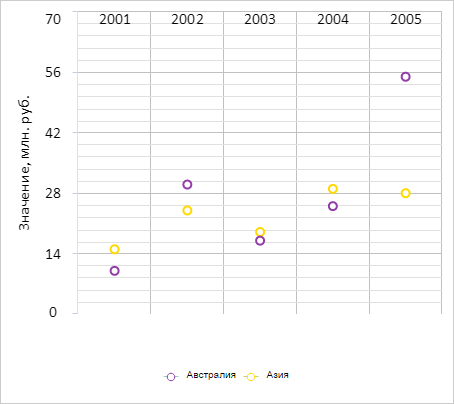

# ChartCanvasAxis.setAxisOffset

ChartCanvasAxis.setAxisOffset
-

# ChartCanvasAxis.setAxisOffset

## Синтаксис

setAxisOffset(value: Number);

## Параметры

value. Значение отступа в пикселях.

## Описание

Метод setAxisOffset устанавливает
 отступ оси диаграммы от её начала в пикселях.

## Пример

Для выполнения примера необходимо наличие на html-странице компонента
 [Chart](../../../Components/Chart/Chart.htm) с наименованием
 «chart» (см. «[Пример
 создания точечной диаграммы](../../../Components/Chart/ChartScatter.htm)»). Установим для оси X отступ, равный
 ширине области построения диаграммы:

// Получаем ось X
var xAxis = chart.getXAxis();
// Получаем настройки области построения диаграммы
var plotBorders = xAxis.getPlotBorders();
xAxis.setAxisOffset(plotBorders.W);
// Перерисовываем диаграмму
chart.redraw(true);
В результате выполнения примера ось Y была смещена к верхней границе
 диаграммы:

См. также:

[ChartCanvasAxis](ChartCanvasAxis.htm)

		Справочная
		 система на версию 10.9
		 от 18/08/2025,
		 © ООО «ФОРСАЙТ»,
